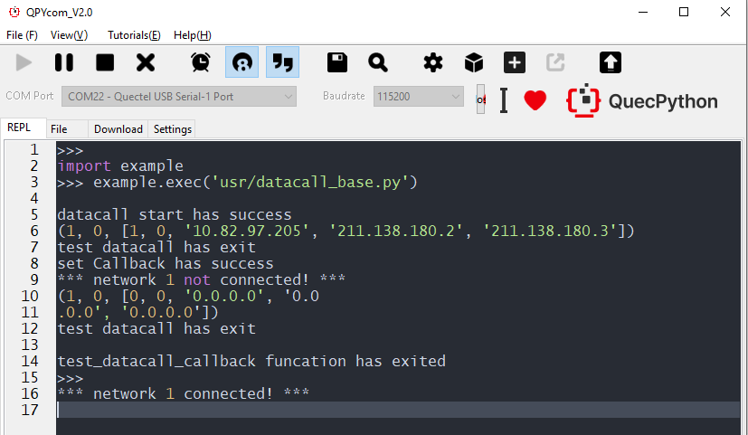

## Revision history

| Version | Date       | Author | Description                   |
| ------- | ---------- | ------ | ----------------------------- |
| 1.0     | 2021-09-13 | Kayden | Modified the original version |

<div align="left">

## QuecPython_dataCall

**Module function：**

Provide relevant port to datacall, start, configure and query the access mode used by terminals to access the network.

For detailed API, please refer to the [Quecpython - DataCall](https://python.quectel.com/wiki/#/en-us/api/QuecPythonClasslib?id=datacall-data-call)

## Quick Start

### Operation procedure

1. Carry out link activation after getting by link call;
2. Get basic data such as IP info;
3. Register callback function of network disconnection and judge network status in callback, after that, recall. 

### Interaction test

```python
>>> import dataCall
>>> import net
>>> dataCall.setApn(1, 0, "3gnet.mnc001.mcc460.gprs", "", "", 0)
0
>>> dataCall.start(1, 0, "3gnet.mnc001.mcc460.gprs", "", "", 0)
0
>>> def nw_cb(args):
        pdp = args[0]
        nw_sta = args[1]
        if nw_sta == 1:
            print("*** network %d connected! ***" % pdp)
        else:
            print("*** network %d not connected! ***" % pdp)
            
>>> dataCall.setCallback(nw_cb)
0
>>> net.setModemFun(4)  # Enter flight mode
0
>>> *** network 1 not connected! *** # After entering flight mode, the network disconnection occurs.Notify the user via callback 
>>> net.setModemFun(1)  # Exit flight mode
0
>>> *** network 1 connected! *** # Exit flight mode, it will call automatically and wait for the access to network, Notify the user via callback. 
```


### Code test 

1. Activate link
2. Print IP info
3. Register callback function
4. Simulate off-line status via flight mode
5. Recall in callback function 

 <a href="code/datacall_base.py" target="_blank">Download Code</a>

**Note:** When running this code, if you want to view it properly, you should insert in the SIM card. 

```python
import dataCall
import net
import utime as time


g_net_status = False


def callback(args):
    pdp = args[0]
    nw_sta = args[1]
    if nw_sta == 1:
        g_net_status = True
        print("*** network %d connected! ***" % pdp)
    else:
        g_net_status = False
        print("*** network %d not connected! ***" % pdp)
        # Enter again 
        test_datacall_module()


def test_datacall_module():
    # Call
    ret = dataCall.start(1, 0, "3gnet.mnc001.mcc460.gprs", "", "", 0)
    if ret == 0:
        print("datacall start has success")
        g_net_status = True
    # Get info such as IP address
    Info = dataCall.getInfo(1, 0)
    print(Info)
    print("test datacall has exit")
    pass


def test_datacall_callback():
    test_datacall_module()
    # Register callback interrupt
    ret = dataCall.setCallback(callback)
    if ret == 0x00:
        print("set Callback has success")
    net.setModemFun(4)  # Enter flight mode
    time.sleep_ms(1000)
    net.setModemFun(1)  # Come back to normal mode
    print("test_datacall_callback funcation has exited")
    pass


if __name__ == "__main__":
    test_datacall_callback()

```

Result



## Brief introduction on data call

To be brief, the data call is a process that building connection with server and getting network access permission via call. As for terminal device, it is to configure APN. 

### About APN

APN, a network access technology and a parameter should be configured when the terminal gets access to network, decides which method would be used to get access to network from the view of terminal. 

In terms of user, there are many peripheral networks can be accessed such as Internet, WAP website, internal network of group and specific network for internal industry. However, different access points are varied in access range and methods. So, in terms of network end, how to learn about which network will be accessed and corresponding IP will be allocated after the terminal is activated?  It is the APN that used to differentiate. That is, APN determines which access mode a user terminal uses to access network.

All operators will use specific APN (Access Point Name), which will be reserved in your SIM card beforehand. If necessary, you should adjust it manually. 

### Implication of APN

The APN will decide which access mode that a terminal uses to access network so as to identify the service type of GPRS. 

Two categories of APN 

- *WAP* service
- Service not included in *WAP*, such as connecting to Internet 

From the view of operator, APN just refers to one logic name. In most cases, the APN is arranged on GGSN device or connected to the GNSS in a logic way. When user gets access to network via GPRS,  it will agent peripheral network via *GGSN*. Therefore, the parameters related to APN setting, filtering and calculating have become one of the most significant parameters to GPRS billing and expense. (As the APN can be used to differentiate the service or the external network)

The overall illustrations of APN have been defined in the *TS23.003 Clause 9 of 3GPP* specification explicitly. 

### APN structure 

The name of APN access point is composed by two parts:  

- Network identifier

- Operator identifier

 Similarly, the operator identifier is also composed by two parts:

- Mobile network code（MNC）

- Mobile country code（MCC）

### APN type

We can divide the APN into four types according to whether it is connected to public network or special network as well as the allocation method of IP address. 

- **Public APN**, abbreviated as APN also. The device which is connected to network gate via public APN will get IP address in dynamic in convenience of access to network by the most. 
- **Public APN with static IP address** - The network gate will allocate static IP address  to device according to the available IP addresses in public network. 
- **Special APN**- It is commonly considered as "APN with VPN". The device with special APN configuration can get access to its inner network via network gate. 
- **The special APN with static IP address** - The network gate will allocate static IP address to device according to the available IP addresses in special network.

Compared with public APN, there is even no need in network connection for special APN. Moreover, under no circumstance shall the special network allow itself to get access to public network but also keep itself in the basic structure of cellular network to make sure the safe data handling. 

### Configure APN 

For QuecPython, you can use the default APN in SIM card or configure APN manually. It is also available to configure APN by calling API function. 

## Referential materials

[What is Access Point Name (APN)](https://1ot.mobi/resources/blog/iot-hacking-series-3-what-is-access-point-name-apn-and-how-it-works)

[APN Configuration](https://prepaid-data-sim-card.fandom.com/wiki/APN_Configuration) 

[Quecpython - dataCall](https://python.quectel.com/wiki/#/en-us/api/QuecPythonClasslib?id=datacall-data-call)

