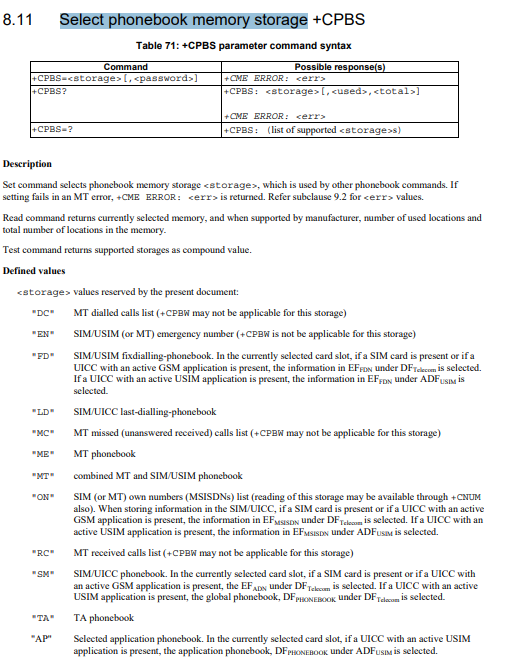

## Revision history

| Version | Date       | Author     | Description                  |
| ------- | ---------- | ---------- | ---------------------------- |
| 1.0     | 2021-09-13 | David.Tang | Modified the initial version |

## Preface

In this document, it briefly introduces how to use the QuecPython SIM card module. For detailed API, please refer to [QuecPython_SIM](https://python.quectel.com/wiki/#/zh-cn/api/QuecPythonClasslib?id=sim-sim%e5%8d%a1).

## Basic illustration on SIM card

The SIM card is divided into Phone card and Ethernet card. Compared with Phone card, the main difference may lie in that the Ethernet card is unavailable to send or receive message owing to lack of phone number. while the phone card can do it, as a result, the phone card is widely used. 

The 2nd generation: Standard Mini card,  also called as SIM card by domestic users 

The 3rd generation: Standard Micro card 

The 4th generation: Standard Nano card 


What we really need is the standard Nano card.  

## Quick start 
Please ensure whether the SIM card is intact before getting SIM card info. 
```python
import sim
# If it returns 1, which means the status is correct. While for other error, please check WIKI SIM API
sim.getStatus()
```
### Get IMSI 
IMSI is the abbreviation of International Mobile Subscriber Identity. 

-  The top 3 digitals refer to Mobile country code (MCC)
-  The subsequent two or three digitals indicate Mobile Network Code (MNC). In E.212, it allows to use the MNC of three-digital, however, it is limited in USA and Canada. 
-  The rest digitals represent the Mobile Subscriber Identity Number (MSIN). 
```python
import sim
sim.getImsi()
```
### Get ICCID
The full name of ICCID is Integrated Circuit Card Identifier. 

- You can consider it as the number of SIM card (ID number)

- Code format: XXXXXX 0MFSS YYGXX XXXX

- The Top 6 codes of operator 

  China Mobile:    898600；898602；898604；898607 ，

  China Unicom:  898601、898606、898609，

  China Telecom: 898603、898611。
  
```python
import sim
sim.iccid()
```

### PIN Operation 
    PIn refers to the personal identification number of SIM card. 
The PIN is used to safeguard the SIM card for fear that being embezzled by others. Once the boot pin is enabled, you should input pin of 4-8 numbers every boot. If the PIN is entered incorrectly for more than three times, the card is automatically locked. To unlock the phone, you need to dial the carrier's customer service hotline via the PUK code.

#### PIN1 
    As the personal identification code, PIN1 is a storage unit in inner SIM card, which can be set on the phone. 
There is a need to input PIN 1 when boot. Correspondingly, the card will be locked if the PIN is inputted in an incorrect way for 3 times. In this situation, you should apply for the PUK from the operator, which will be used to unlock the phone. However, if the PIN is inputted in an incorrect way for 10 times, The card would be invalid. you should backup in the service hall of certain operator with your own valid certificate. 

#### PIN 2
    IF it displays the "Restrict call by PIN2" on the phone, the main reason may result from the enabled PIN2 function. 
However, the network does not support the function of PIN 2 code, so the function cannot be used even if enabled. If the PIN 2 code is locked accidentally, the normal use of the mobile phone will not be affected. Please bring the valid certificate of the owner to the business hall of the operation service provider for free unlocking service. Enable The PIN verification of the SIM card. After this function is enabled, the SIM card can be used normally only after the correct PIN is entered successfully. There were only 3 attempts to enter the PIN code, and all three attempts were wrong. The SIM card was locked and PUK was required to unlock it.

#### Enable and verify PIN
```python
import sim
# Modify the 1234 as your PIN. Normally, it is 4-8 digitals. For these type of operation, please be cautious. 
sim.enablePin("1234")
# Before verifying pin, you should enable pin. 
sim.verifyPin("1234")
# Disable pin
sim.disablePin("1234")
```
#### Modify pin
```python
import sim
# The 1234 serves as the old pin, while the 4321 serves as the new pin
sim.changePin("1234", "4321")
```

### Reset PIN and PUK

If the Pin is entered incorrectly for too many times, which makes it a failure to input the Pin. In this case, you need to use the PUK to unlock.

#### PUK1
PUK (PUK1) consists of 8 digits, which cannot be changed by the user. The PUK can be changed only after the SIM card is replaced. When the phone PIN  is locked and prompted to input PUK . Please aware that you have only 10 chances left for the SIM card will be permanently locked if you enter it incorrectly for 10 times, that is, scrapped. The PUK of some SIM cards comes with the card when users purchasing the card.

#### PUK 2
PIN2 code is used by the telecom office for billing and is generally not provided to users. If input incorrectly for three times, the phone will be unlocked via PUK 2, which is as same as that in PIN and PUK described earlier. However, these two passwords are related to network billing and modifications to the internal data of the SIM card, so they will not be exposed.  Furthermore, even if the PIN 2 password is locked, it will not affect the normal use of the phone. Therefore, there is no need to pay attention to PIN 2 and PUK 2 particularly. 

#### Unlock pin
```python
import sim
# 12345678 serves as PUK, while 0000 serves as new PIN
sim.unblockPin("12345678", "0000")
```

### Read/Write SIM memory storage

####  Phonebook Memory Storage
The Phonebook Memory Storage is the storage area for the phonebook of SIM card. For details, please refer to  [ts_127007v100300p.pdf](https://www.etsi.org/deliver/etsi_ts/127000_127099/127007/10.03.00_60/ts_127007v100300p.pdf).



```python
>>> import sim
>>> sim.getStatus()
1
>>> sim.getImsi()
'460110847679419'
>>> sim.getIccid()
'89860319747555431000'
# Write Phonebook
>>> sim.writePhonebook(9, 1, 'Tom', '18144786859')
0
>>> sim.writePhonebook(9, 2, 'z', '18144786859')
0
>>> sim.readPhonebook(9, 1, 4, "")
(1, [(1, 'Tom', '18144786859')])
>>> sim.readPhonebook(9, 2, 4, "")
(1, [(2, 'z', '18144786859')])
```
## Referential materials

**[ts_127007v100300p.pdf](https://www.etsi.org/deliver/etsi_ts/127000_127099/127007/10.03.00_60/ts_127007v100300p.pdf)** 

**[Quecpython sim - SIM Card Library](https://python.quectel.com/wiki/#/en-us/api/QuecPythonClasslib?id=sim-sim-card)**

