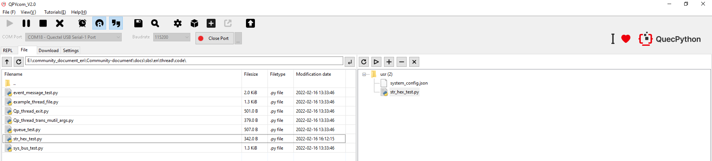
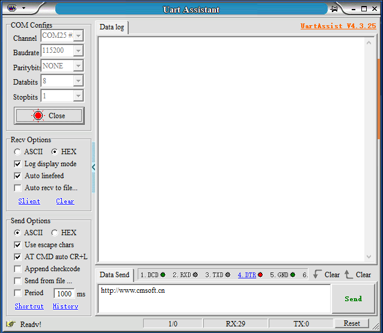
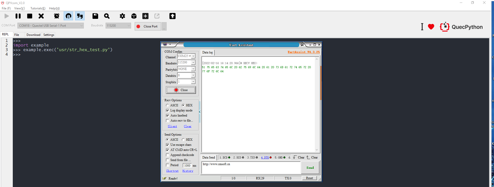
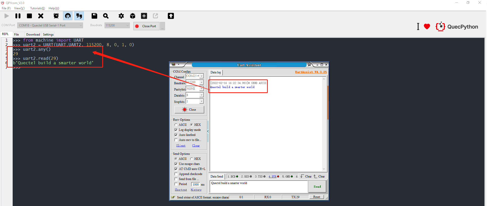

Revision History

| Version | Date       | Author     | Description                          |
| ------- | ---------- | ---------- | ------------------------------------ |
| 1.0     | 2021-09-28 | David.Tang | Initial version                      |
| 1.1     | 2022-02-16 | David.Tang | Translate Chinese operation pictures |

This document is specialized for the conversion between string and Hexadecimal. Please check the details. 

## Bitwise operation

First of all, we will learn about bitwise operation. The digitals in PC are saved in a format of binary. While the bitwise operation is aimed at binary. In Python, there are bitwise and operators, bitwise or operators, bitwise xor operators, bitwise not operators, left-shift operators, and right-shift operators. For more details, please refer to [Bitwise operation](https://blog.csdn.net/csdn_edition/article/details/109402978).

### Bitwise AND operators

Bitwise AND operators &: If both bits  in the compared position are 1, the bit in the resulting binary representation is 1 (1 × 1 = 1); otherwise, the result is 0 (1 × 0 = 0 and 0 × 0 = 0). For example:

```python
>>> a= 60
>>> b= 13
>>> a & b
12
```

### Bitwise OR operators

Bitwise OR |: As long as the one of the corresponding two binary is 1, the result will be 1.  

```python
>>> a=60
>>> b= 13
>>> a | b
61
```

### Bitwise XOR operators

Bitwise XOR operators ^: The result in each position is 1 if only one of the bits is 1, but will be 0 if both are 0 or both are 1. In this we perform the comparison of two bits, being 1 if the two bits are different, and 0 if they are the same. For example:

```python
>>> a=60
>>> b= 13
>>> a ^ b
49
```

### Bitwise NOT operators ~ 

Bitwise NOT operators  ~: Take the opposite value of every binary data, which means converting 1 to 0 and 0 to 1. it is similar with ~x to -x-1. 

```python
>>> a=60
>>> ~a 
-61
```

### Left-shift operators << 

 Left-shift operators <<: Move all binaries to the left for several bits, which are assigned by the figure on the right, the most significant bit will be discarded and the lowest significant bit will be supplemented by 0. 

```python
>>> a=60
>>> a << 2 
240
```

### Right-shift operators   >>

Right-shift operators >>: Move all binaries to the right for several bits, while the figure on the right assigned the shift bits. 

```python
>>> a=60
>>> a >> 2 
15
```

## String and HEX 

### The package of conversion of string and HEX

As for the mutual conversion between string and HEX, we provide one package since there is none in Python. 

```python
str_test = 'Quectel build a smarter world'
class String:
    def to_hex(a, b=""):  # Realizable function: convert to HEX format, it is also available to add the needed separator
        Hex = ''.join([hex(ord(c)).replace('0x', b) for c in a])
        return Hex,len(a)

    def from_hex(a,b=''): # Realizable function: convert to STR. If there exists separator, add parameter conversion. 
        Str = ''.join([chr(int(c.replace(b, ''), 16)) for c in [a[i:i+2+len(b)] for i in range(0, len(a), 2+len(b))]])
        return Str

hex_test = String.to_hex(str_test)
print(type(hex_test[0]))
print(hex_test[1])
print(hex_test)

hex_test = str(hex_test[0])
str_test = String.from_hex(hex_test)
print(str_test)
```

###  Application of conversion between string and HEX.

Of course, the converted HEX still can't receive and analyze via serial interface, therefore, further conversion is needed. Take EC600SCNLB as an example, we will carry out a simple test based on it.  

```python
str_test = 'Quectel build a smarter world'
def str_to_hex(s):
    list_hex = ' '.join([hex(ord(c)) for c in s]).split()
    list = [int(i,16) for i in list_hex]
    bytearr = bytearray(list)
    return bytearr
hex_test = str_to_hex(str_test)
```

​	1. Compile following codes and name it as *str_hex_test.py*.

```python
from machine import UART
uart0 = UART(UART.UART2, 115200, 8, 0, 1, 0)
str_test = 'Quectel build a smarter world'
def str_to_hex(s):
    list_hex = ' '.join([hex(ord(c)) for c in s]).split()
    list = [int(i,16) for i in list_hex]
    bytearr = bytearray(list)
    return bytearr
hex_test = str_to_hex(str_test)
uart0.write(hex_test)
```

​	2. Download above files into the module and run, then enable serial port debugging tool. (Here, it is the UartAssist that is used)





3. Run the program and check the result in serial port tool. 



**Tips：**

If received via ASCII, there will be displayed with a form of string. 

​	4. For module serial port reception: Whether the serial port tool sends ASCII or HEX data, it is the bytes data that read by serial port.



## Encode and Decode

For encoding  and decoding, ASCII, UTF-8 and GBK are widely used, as for python, it is embedded with corresponding package. Hence,  you can  just take the [encode and decode](https://blog.csdn.net/qq_26442553/article/details/94440502) as a reference. 

```python
import ubinascii as binascii
import ustruct as struct

def example(express, result=None):
    if result == None:
        result = eval(express)
    print(express, ' ==> ', result)
if __name__ == '__main__':
    print('encode and decode:')
    print("str to utf-8", end=': ');
    example("u'xiaoming'.encode('utf-8')")
    print("utf-8 to str", end=': ');
    s_utf = b'\xe5\xb0\x8f\xe6\x98\x8e'
    example("s_utf.decode('utf-8')")
    print("Similarly, there are encode('gbk')，decode('gbk'),encode('gb2312'),decode('gb2312')")

```

## Conversion between binary and ASCII, Package and unzip. 

For [Conversion between binary and ASCII](https://python.quectel.com/wiki/#/zh-cn/api/pythonStdlib?id=ubinascii-二进制与ascii转换) and [ustruct -Package and unzip the original data type](https://python.quectel.com/wiki/#/zh-cn/api/pythonStdlib?id=ustruct-打包和解压原始数据类型), which has been encapsulated on the FW of the module.  

