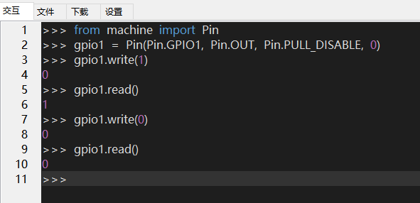
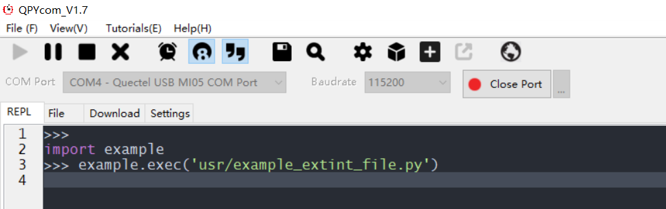
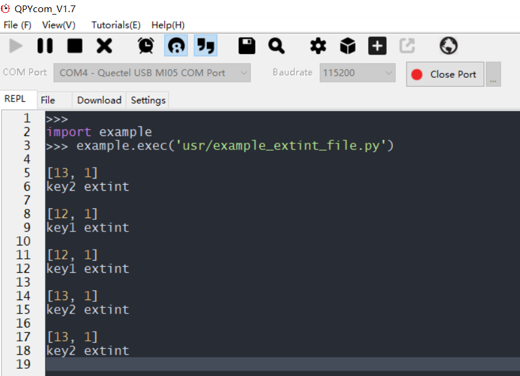

## 修订历史

| Version | Date       | Author     | Change expression |
| ------- | ---------- | ---------- | ----------------- |
| 1.0     | 2021-09-06 | David.Tang | Initial version   |

## PIN

文档主要基于EC600X（包括EC600S、EC600N、EC600U）先介绍如何使用QuecPython_GPIO，GPIO通常用于连接驱动LED、蜂鸣器、继电器等等，同样也可以用来读取KEY、开关状态、外部IC的引脚电平状态等等。通过本文你将了解到GPIO的所有设置参数及使用方法。

###  硬件设计

对于目前QuecPython支持的GPIO，在官网wiki已经详细列出，具体位置为：[PIN_API库](https://python.quectel.com/wiki/#/zh-cn/api/QuecPythonClasslib?id=pin)

###  软件设计

软件设计主要参考官网的wiki，具体位置为：[PIN_API库](https://python.quectel.com/wiki/#/zh-cn/api/QuecPythonClasslib?id=pin)

### 交互操作

使用QPYcom工具和模组进行交互，示例如下：



注意：

1.  from machine import Pin目的是让Pin模块在当前空间可见。

2.  只有from machine import Pin模块，才能使用Pin内的函数和变量。

3.  上述操作没有连接任何外设，仅作为熟悉指令参考

### 下载验证

由于GPIO的控制比较简单，可以外接一个三极管等器件自行测试。

## ExtInt

GPIO介绍过后，接着介绍外部中断，普通GPIO可以随时查询Pin引脚的电平状态，但却不能及时发现电平的变化，而外部中断就能完美的解决这个问题。若设定了上升沿触发外部中断时，当电平从低电平上升到高电平瞬间，就会触发外部中断，从而在电平变化时立马执行回调函数。

### 硬件设计

同上

### 软件设计

软件设计主要参考官网的wiki，地址：[ExtInt_API库](https://python.quectel.com/wiki/#/zh-cn/api/QuecPythonClasslib?id=extint)

### 交互操作

使用QPYcom工具和模组进行交互，示例如下：


注意：

**回调函数fun(args)中的args，是引脚中断后返回的内部GPIO行号，一般用不上，但也要设置。**

### 下载验证

模组：EC600N_QuecPython开发板

按键触发：KEY1和KEY2

#### 软件代码

配套demo的参考代码为文档同目录下的example_extint_file.py文件。下载此文件到模组运行，代码如下：

```python
from machine import ExtInt 
import utime    
def fun1(args):  
	print(args)  
	print("key1 extint")   
def fun2(args):  
	print(args)  
	print("key2 extint")   
extint1 = ExtInt(ExtInt.GPIO12, ExtInt.IRQ_FALLING, ExtInt.PULL_PU, fun1) 
extint2 = ExtInt(ExtInt.GPIO13, ExtInt.IRQ_FALLING, ExtInt.PULL_PU, fun2) 
extint1.enable()
extint2.enable()
while True:  
	utime.sleep_ms(200)  
```

#### 硬件连接

对于QuecPython开发板来说，无需另外的硬件连接，开发板正常供电即可

#### 运行效果

1.打开QPYcom，运行example_extint_file.py，至如下界面：



2.随意按下按键，即可触发对应的回调进行打印，结果如下：




<!-- * [下载代码](code/example_extint_file.py)  -->

 <a href="code/example_extint_file.py" target="_blank">下载代码</a>

## 名词解释

低电平：通常用0来表示低电平

高电平：通常用1来表示高电平

上升沿：从低电平上升到高电平的边沿

下降沿：从高电平上升到低电平的边沿

回调函数：一个普通函数，在满足设定条件下被触发执行这个函数

浮空：Pin引脚直出，没有默认电平，处于不稳定状态

上拉：Pin引脚内部有个电阻拉到VCC，默认为高电平

下拉：Pin引脚内部有个电阻拉到GND，默认为低电平

输入：Pin引脚的电平状态随外部变化

输出：Pin引脚的电平驱动外围电路

中断：停止执行当前的程序去执行另一段程序，这个过程叫中断