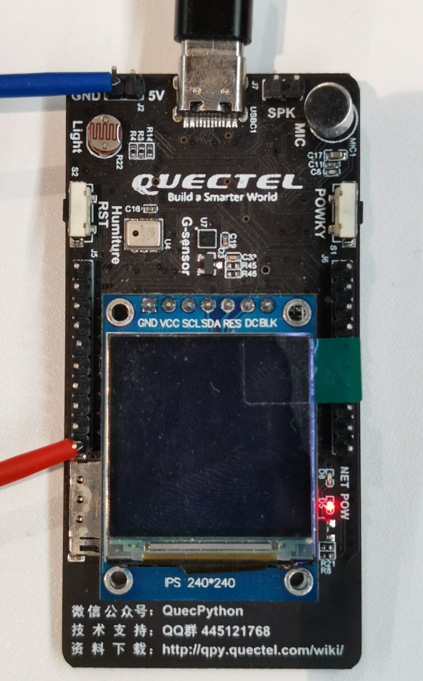
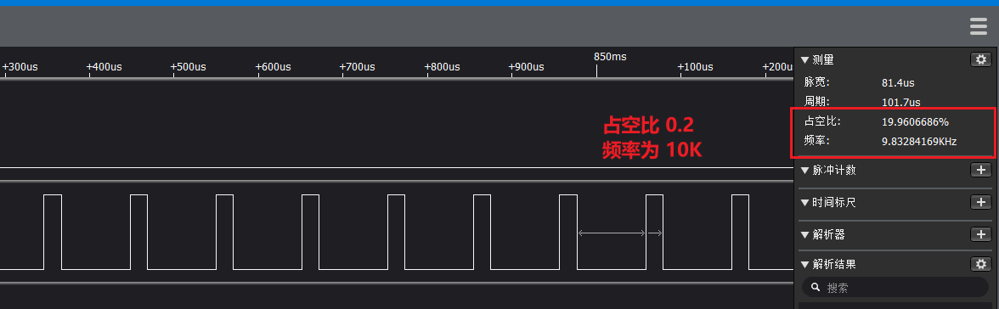

## 修订历史

| Version | Date       | Author     | Change expression |
| ------- | ---------- | ---------- | ----------------- |
| 1.0     | 2021-09-06 | David.Tang | Initial version   |

文档主要基于EC600X（包括EC600S、EC600N、EC600U）介绍如何使用 QuecPython_PWM。PWM是一种对模拟信号电平进行数字编码的方法。根据相应载荷的变化来调制晶体管基极或MOS管栅极的偏置，来实现晶体管或MOS管导通时间的改变，从而实现开关稳压电源输出的改变。这种方式能使电源的输出电压在工作条件变化时保持恒定，是利用微处理器的数字信号对模拟电路进行控制的一种非常有效的技术。脉冲宽度调制是利用微处理器的数字输出来对模拟电路进行控制的一种非常有效的技术，广泛应用在从测量、通信到功率控制与变换的许多领域中。

## 软件设计

软件设计主要参考官网的wiki，地址：[PWM_API库](https://python.quectel.com/wiki/#/zh-cn/api/QuecPythonClasslib?id=pwm)

## 交互操作

下面我们使用 EC600S V1.1 版本的硬件， 使用 69号引脚 G1发出PWM 波形。 


红蓝两根线接到逻辑分析仪上。然后运行下面的代码，即可抓取到波形。

由于PWM API 接口 分为了 1ms , 10us , 1us三个等级。

```python
from misc import PWM
import utime as time
import log


class pwmclass():
    def __init__(self):
        self.Log = log.basicConfig()
        self.Log = log.getLogger("pwm_class")
        # self.Log.setLevel(log.INFO)
        self.Log.setLevel(log.DEBUG)
        self.pwm = None
        pass

    """
        注：EC100YCN平台，支持PWM0~PWM3，对应引脚如下：
        PWM0 – 引脚号19
        PWM1 – 引脚号18
        PWM2 – 引脚号23
        PWM3 – 引脚号22

        注：EC600SCN平台，支持PWM0~PWM3，对应引脚如下：
        PWM0 – 引脚号52
        PWM1 – 引脚号53
        PWM2 – 引脚号70
        PWM3 – 引脚号69
    """

    # fre 频率为K， (0.0 ~ 1000]
    # Duty_Cycle (0~1)
    def init(self, Pwm_pin=PWM.PWM3, fre=1, Duty_Cycle=0.5):
        # https://python.quectel.com/wiki/#/zh-cn/api/QuecPythonClasslib?id=pwm

        # 根据频率，计算出高低电平
        # 计算出周期时间
        if (fre <= 0) or (fre > 1000):
            self.Log.error(
                "ERROR: {0} 不支持的频率参数, 请输入 (0 ~ 1000]k 范围的频率".format(fre))
        if (Duty_Cycle < 0.000) or (Duty_Cycle >= 1):
            self.Log.error(
                "ERROR: {0} 不支持的占空比参数, 请输入 (0~1.0) 范围的频率".format(Duty_Cycle))
        # us 单位
        cycle_time = int(1 * 1000 / fre)
        hight_time = int(cycle_time * Duty_Cycle)
        self.Log.info("""设置 {0} 设备 频率为 {1}khz 
                    周期为 {2}us 占空比 {3}us""".format(Pwm_pin, fre, cycle_time,
                                                  hight_time))
        # ms 周期范围
        # 周期在 (1K us ~ 1000K us)
        if cycle_time > 1000:
            self.pwm = PWM(Pwm_pin, PWM.ABOVE_MS, int(hight_time / 1000),
                           int(cycle_time / 1000))
        # 周期在 10us ~ 15.75ms
        if (cycle_time > 10) and (cycle_time < 15750):
            self.pwm = PWM(Pwm_pin, PWM.ABOVE_10US, int(hight_time / 10),
                           int(cycle_time / 10))
        # 周期在 (0~157us)
        if (cycle_time > 0) and (cycle_time < 157):
            self.pwm = PWM(Pwm_pin, PWM.ABOVE_1US, hight_time, cycle_time)

    def deinit(self, fre=0):
        self.pwm = None
        pass

    def start(self, fre=1):
        self.Log.info("开始输出 PWM 波形".format())
        if self.pwm is not None:
            self.pwm.open()
        pass

    def stop(self):
        if self.pwm is not None:
            self.pwm.close()
        pass


def test_pwm(fre, duty, delay=2):
    obj_pwm = pwmclass()
    obj_pwm.init(fre=fre, Duty_Cycle=duty, Pwm_pin=PWM.PWM3)
    obj_pwm.start()
    time.sleep(delay)
    obj_pwm.stop()
    obj_pwm.deinit()


if __name__ == "__main__":
    # 频率 1K， 占空比 0.1
    test_pwm(fre=1, duty=0.1)
    # 频率 10K， 占空比 0.2
    test_pwm(fre=10, duty=0.2)
    # 频率 100K， 占空比 0.4
    test_pwm(fre=100, duty=0.4)

```


上面我们展示了使用封装的**PWMclass**直接输出， 1K、10K、100K的波形。

## 名词解释

PWM：脉冲宽度调制

高电平：通常高于用0.8V认为是高电平

低电平：通常低于用0.6V认为是低电平

周期：低电平和高电平时间的总和

占空比：高电平占整个周期的比例