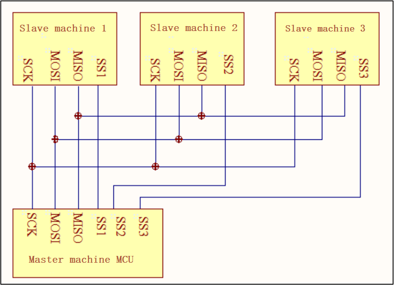
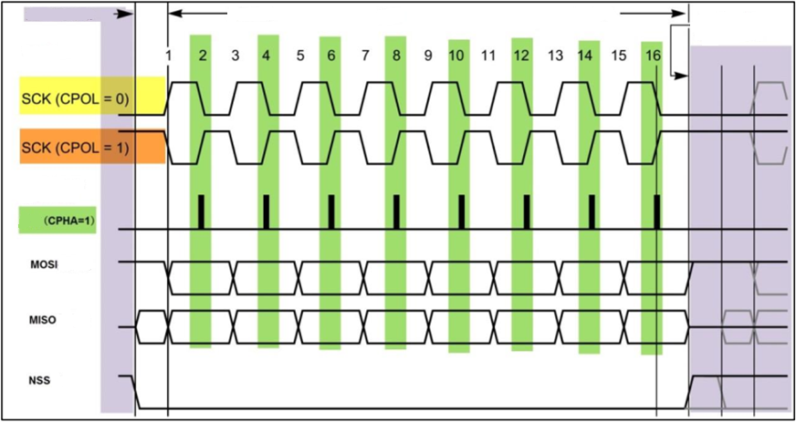

# QuecPython SPI总线开发

## 修订历史

| 版本 | 日期       | 作者 | 变更表述 |
| ---- | ---------- | ---- | -------- |
| 1.0  | 2021-09-14 | Grey | 初版     |

文档主要基于EC600x（包括EC600S、EC600N、EC600U）介绍如何使用 QuecPython_SPI 功能，通过本文你将了解到 EC600x_SPI 的参数设置及使用方法。

有关API详解请参考 [QuecPython-machine - spi](https://python.quectel.com/wiki/#/zh-cn/api/QuecPythonClasslib?id=spi)


## SPI 简介

SPI，是英语 Serial Peripheral interface 的缩写，顾名思义就是串行外围设备接口。是 Motorola 首先在其 MC68HCXX 列处理器上定义的。SPI接口主要应用在 EEPROM，FLASH，实时时钟，AD转换器，还有数字信号处理器和数字信号解码器之间。SPI是一种高速的，全双工，同步的通信总线，并且在芯片的管脚上只占用四根线，节约了芯片的管脚，同时为PCB的布局上节省空间，提供方便，正是出于这种简单易用的特性，现在越来越多的芯片集成了这种通信协议。


### 主-从模式(Master-Slave) 

SPI 规定了两个 SPI 设备之间通信必须由主设备 (Master) 来控制次设备 (Slave)。一个 Master 设备可以通过提供 Clock 以及对 Slave 设备进行片选 (Slave Select) 来控制多个 Slave 设备，SPI 协议还规定 Slave 设备的 Clock 由 Master 设备通过 SCK 管脚提供给 Slave 设备，Slave 设备本身不能产生或控制 Clock，没有 Clock 则 Slave 设备不能正常工作。




### 同步方式(Synchronous)

Master 设备会根据将要交换的数据来产生相应的时钟脉冲(Clock Pulse)，时钟脉冲组成了时钟信号(Clock Signal)，时钟信号通过时钟极性 (CPOL) 和 时钟相位 (CPHA) 控制着两个 SPI 设备间何时数据交换以及何时对接收到的数据进行采样，来保证数据在两个设备之间是同步传输的。


### 四种通信模式

**时钟极性 CPOL** 是指 SPI 通讯设备处于空闲状态时，SCK 信号线的电平信号(即 SPI 通讯开始前、 NSS 线为高电平时 SCK 的状态)。 CPOL=0 时， SCK 在空闲状态时为低电平，CPOL=1 时，则相反。

 **时钟相位 CPHA** 是指数据的采样的时刻，当 CPHA=0 时， MOSI 或 MISO 数据线上的信号将会在 SCK 时钟线的“奇数边沿” 被采样。当 CPHA=1 时，数据线在 SCK 的“偶数边沿” 采样。

根据 **时钟极性 CPOL** 与 **时钟相位 CPHA** 的不同，SPI具有四种通信模式。

| SPI mode | CPOL | CPHA | SCK Clock when idle | Sampling moment |
| -------- | ---- | ---- | ------------------- | --------------- |
| 0        | 0    | 0    | Low level           | Odd edge        |
| 1        | 0    | 1    | Low level           | Even edge       |
| 2        | 1    | 0    | High level          | Odd edge        |
| 3        | 1    | 1    | High level          | Even edge       |





### 数据交换(Data Exchanges)

SPI 设备间的数据传输之所以又被称为数据交换，是因为 SPI 协议规定一个 SPI 设备不能在数据通信过程中仅仅只充当一个 "发送者(Transmitter)" 或者 "接收者(Receiver)"。在每个 Clock 周期内，SPI 设备都会发送并接收一个 bit 大小的数据，相当于该设备有一个 bit 大小的数据被交换了。

一个 Slave 设备要想能够接收到 Master 发过来的控制信号，必须在此之前能够被 Master 设备进行访问 (Access)。所以， Master 设备必须首先通过 SS/CS pin 对 Slave 设备进行片选，把想要访问的 Slave 设备选上，在数据传输的过程中，每次接收到的数据必须在下一次数据传输之前被采样。如果之前接收到的数据没有被读取，那么这些已经接收完成的数据将有可能会被丢弃，导致 SPI 物理模块最终失效。因此，在程序中一般都会在 SPI 传输完数据后，去读取 SPI 设备里的数据，即使这些数据(Dummy Data)在我们的程序里是无用的。

SPI只有主模式和从模式之分，没有读和写的说法。因为实质上每次SPI是主从设备在交换数据。也就是说，你发一个数据必然会收到一个数据；你要收一个数据必须也要先发一个数据。


## SPI通信

### 实验代码

以下代码适合EC600x 开发板进行 SPI 自发自收通信测试。**实验前提：短接 SPI_MISO 与 SPI_MOSI 引脚**。

```python
# -*- coding: UTF-8 -*-
import utime
from machine import SPI
from machine import Pin

#  Shield the data inteference of GNSS module. As the SPI_MISO and SPI_MOSI are multiplexed as UART1, A GNSS module (L76K)is also connected to EVB. In order to disconnect the inteference to SPI communition by data from L76K, followiing two lines of codes should be added. 
gpio11 = Pin(Pin.GPIO11, Pin.OUT, Pin.PULL_PD, 0)   # Used in EC600S/EC600N
gpio11.write(0)                                     # Used in EC600S/EC600N

w_data = "Grey"
r_data = bytearray(len(w_data))
count = 10  # Running count

# Please select codes with the module type
spi_obj = SPI(1, 0, 1)  # Used in EC600S/N
# spi_obj = SPI(0, 0, 1)  # Used in EC600U

while count:
    count -= 1
    utime.sleep(1)
    ret = spi_obj.write_read(r_data, w_data, 100)
    if ret == -1:
        SPI_msg = "SPIReadError"
    else:
        SPI_msg = "SPIRead:{}  running:{:0>2d}".format(r_data, count)
    print(SPI_msg)
```


### 实验现象


## 配套代码

<!-- * [下载代码](code/code_SPI.py) -->
 <a href="code/code_SPI.py" target="_blank">下载代码</a>