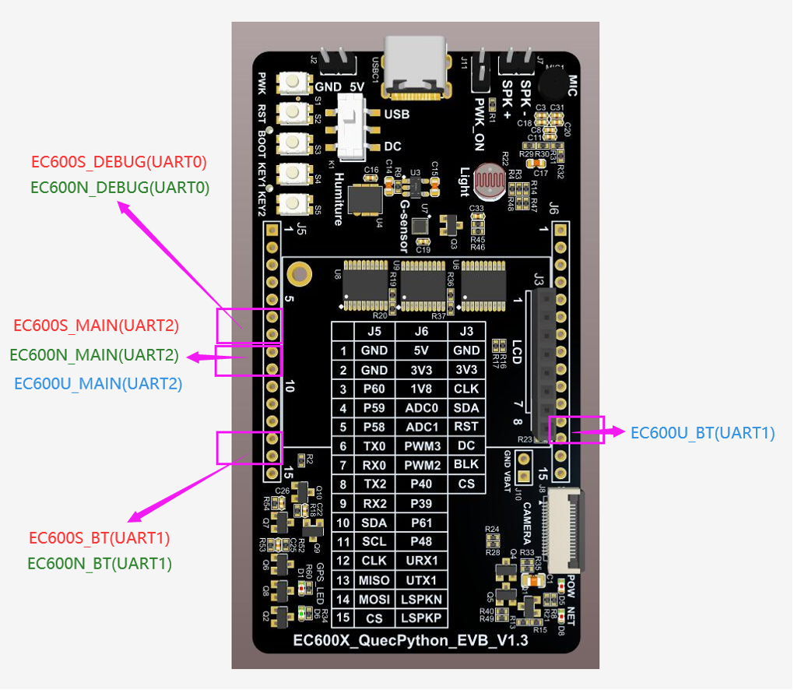
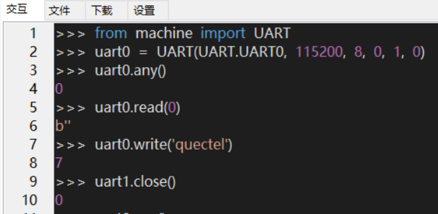
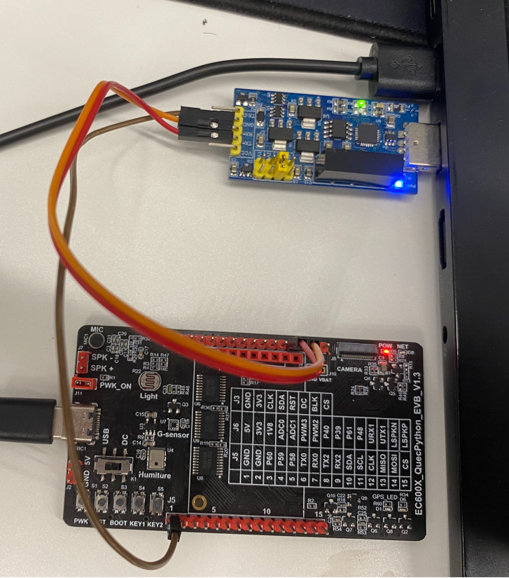
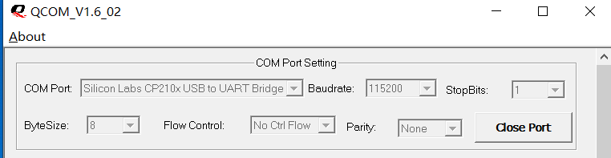
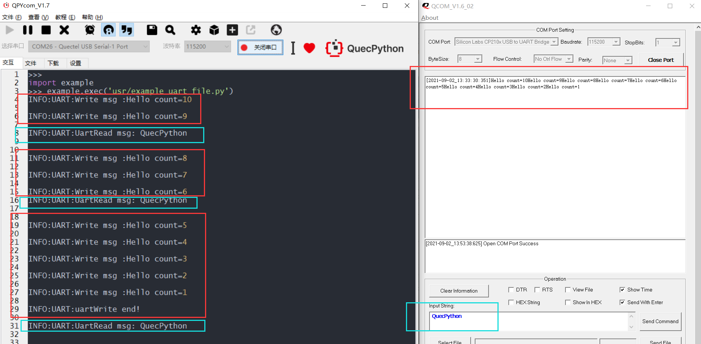

## 修订历史

| Version | Date       | Author     | Change expression |
| ------- | ---------- | ---------- | ----------------- |
| 1.0     | 2021-09-02 | David.Tang | Initial version   |

文档主要基于EC600X（包括EC600S、EC600N、EC600U）介绍如何使用QuecPython_UART，UART作为一种通用串行数据总线，用于异步通信，可实现全双工传输和接收。在嵌入式设计中，UART用来与PC进行通信，包括监控调试器和其它器件。通过本文你将了解到EC600X_UART的所有设置参数及使用方法。

## 硬件设计

针对不同的模组，开放的UART列表如下：

| module_name | module_UART_name                                      | module_UART_PIN                             |
| ----------- | ----------------------------------------------------- | ------------------------------------------- |
| EC600S/N    | UART0_DEBUG PORT<br>UART1_BT PORT<br/>UART2_MAIN PORT | PIN71、PIN72<br>PIN2、PIN3<br/>PIN31、PIN32 |
| EC600U      | UART1_BT PORT<br/>UART2_MAIN PORT                     | PIN123、PIN124<br>PIN31、32                 |

对于V1.2和V1.3的QuecPython开发板，具体的UART位置标记如下：



备注：

1. 针对其他版本的QuecPython开发板，可以根据上述的PIN脚号和对应版本的原理图在开发板上面找到对应的位置
2. 后续wiki对于UART_PIN更新后，可参考wiki里面的说明，忽略上述的表格

## 软件设计

软件设计主要参考官网的wiki，地址：[UART_API库](https://python.quectel.com/wiki/#/zh-cn/api/QuecPythonClasslib?id=uart)

## 交互操作

使用QPYcom工具和模组进行交互，下面实例是基于UART0，对于UART1和UART2的话，操作类似，此处省略。

注意：

1.  from machine import UART目的是让UART模块在当前空间可见。

2.  只有from machine import UART模块，才能使用UART内的函数和变量。

3.  上述操作没有连接任何外设，仅作为熟悉指令参考

## 下载验证

模组：EC600U_QuecPython开发板

串口：UART1

### 软件代码

配套demo的参考代码为文档同目录下的example_uart_file.py文件。下载此文件到模组运行，代码如下：

```python
import _thread  # 导入线程模块
import utime  # 导入定时模块
import log  # 导入log模块
from machine import UART  # 导入UART模块

# 设置日志输出级别
log.basicConfig(level=log.INFO)
uart_log = log.getLogger("UART")
uart = UART(UART.UART1, 115200, 8, 0, 1, 0)

def uartWrite():
    global uart
    count = 10
    while count:
        write_msg = "Hello count={}".format(count)
        uart.write(write_msg)
        uart_log.info("Write msg :{}".format(write_msg))
        utime.sleep(1)
        count -= 1
    uart_log.info("uartWrite end!")


def UartRead():
    global uart
    while 1:
        msgLen = uart.any()
        utime.sleep(0.1)
        # 当有数据时进行读取
        if msgLen:
            msg = uart.read(msgLen)
            utf8_msg = msg.decode()
            uart_log.info("UartRead msg: {}".format(utf8_msg))
        else:
            continue


def run():
    _thread.start_new_thread(UartRead, ())
    _thread.start_new_thread(uartWrite, ())

if __name__ == "__main__":
    run()
    while True:
        utime.sleep(0.5)
```

### 硬件连接

使用type-c给模块供电，UART与TTL转USB模块的连接如下表（仅供参考）：

| 开发板上的PIN脚 | TTL转USB模块 | 图中线的颜色 |
| --------------- | ------------ | ------------ |
| J6的12脚        | Tx           | 红色         |
| J6的13脚        | Rx           | 橘色         |
| GND             | GND          | 棕色         |

硬件连接展示图如下图所示：


### 运行效果

1. 打开QCOM，连接TTL转USB对应的端口，如下图所示：

   
2.  打开QPYcom，运行example_uart_file.py，可在QCOM查看到UART write数据，现象如下截图红色部分
    
3.  然后QCOM上写QuecPython多次，可在QPYcom上查看读取的数据。现象如下截图蓝色部分




## 配套代码

<!-- * [下载代码](code/example_uart_file.py) -->
 <a href="code/example_uart_file.py" target="_blank">下载代码</a>