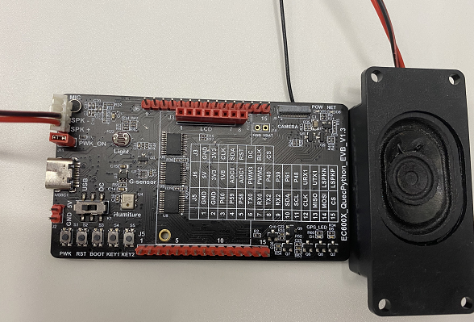
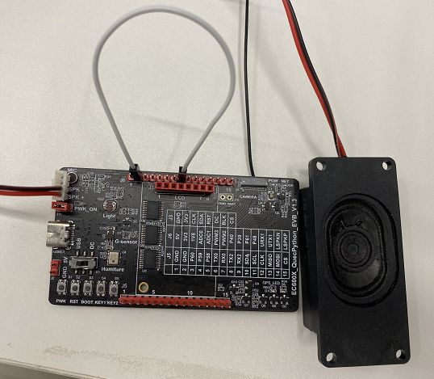
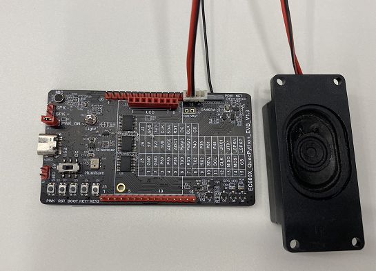

## 修订历史
| 版本 | 日期 | 作者 | 变更表述 |
|------|------|------|------|
| 1.0 | 2021-4-6 | gary.zhou | 初版 |
| 1.1 | 2021-9-16 | David.Tang | 增加多模组的适用性 |
| 1.2 | 2021-10-08 | rivern | 调整格式 |


## 硬件连接

| 开发板型号                                               | 开发板对应PIN脚                | 开发板上对应的连接位置 | 对应的音频通道 |
| -------------------------------------------------------- | ------------------------------ | ---------------------- | -------------- |
| EC600S_QuecPython_EVB_V1.3<br>EC600N_QuecPython_EVB_V1.3 | PIN21、PIN22                   | J7                     | 通道0          |
| EC600U_QuecPython_EVB_V1.3                               | PIN21、PIN22<br>PIN109、PIN110 | J7<br>J6的PIN14、PIN15 | 通道0<br>通道2 |

针对EC600S/N的硬件连接图如下：



针对EC600U_通道0的硬件连接图如下：



针对EC600U_通道2的硬件连接图如下：



## 下载验证

1. 根据测试场景,调整下面代码的注释。

   ```python
   import utime as time
   import audio
   from machine import Pin
   
   # 对于EC600S和EC600N的话,下面的代码不需要做任何修改,就可以播放
   # 对于EC600U的通道0的话,注释掉18行,18行的配置对这个播放没有影响
   # 对于EC600U的通道2的话,注释掉12行和19行,取消注释13行
   
   def example_audio_mp3():
       aud = audio.Audio(0)  # 配置通道0
       # aud = audio.Audio(2)  # 配置通道2
       aud.setVolume(9)
       # 使能外接喇叭播放
       # Pin(Pin.GPIO11, Pin.OUT, Pin.PULL_PD, 1)  # 官方板V1.1使用
       Pin(Pin.GPIO9, Pin.OUT, Pin.PULL_PD, 1)  # 官方板V1.2和V1.3使用
       # U: 表示用户目录, GUI下载工具会将文件下载到 /usr 文件下
       aud.play(2, 1, "U:/example.mp3")
       pass
   
   if __name__ == "__main__":
       example_audio_mp3()
   ```
   
2. 将随包的 example.mp3 和修改好的 example_audio_file.py 文件下载到开发板中。

3. 运行 example_audio_file.py 脚本即可。


## 配套代码

<!-- * [下载代码和音频文件](code/Audio.zip)  -->

 <a href="code/Audio.zip" target="_blank">下载代码和音频文件</a>