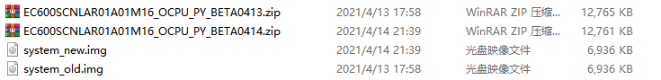
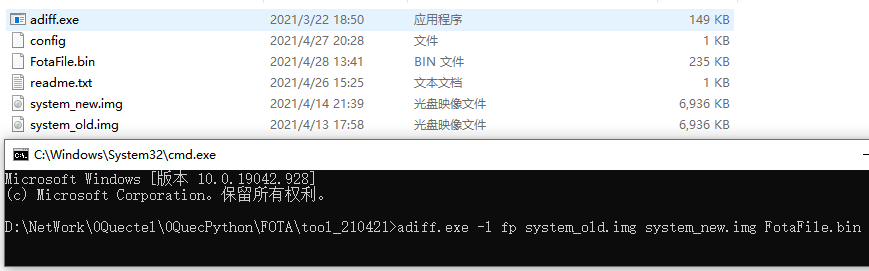
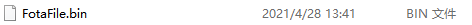
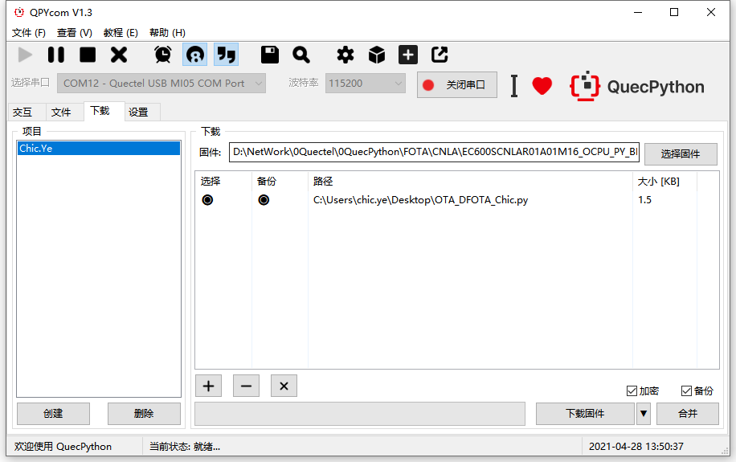

## 文档历史

**修订记录**

| Version | Date       | Author  | Change expression |
| ------- | ---------- | ------- | ----------------- |
| 1.0     | 2021-09-29 | Chic.YE | 初版              |


## ASR 固件升级

本文主要基于EC600S-CNLA介绍如何升级固件，通过本文您将了解到EC600S-CNLA固件差分升级的使用方法。 


## 操作步骤

1、 提取升级文件：

将‘新’‘旧’两个固件包中的system.img文件复制出来，并重命名system_old.img、system_new.img，如下图：



 

2、 配置 config 文件如下：

```python
[Image_List]

Number_of_Images = 1

1_Image_Enable = 1

1_Image_Image_ID = 0x30

1_Image_Path = system.bin

1_Image_Flash_Entry_Address = 0x00024000

1_Image_ID_Name = 1
```

 

3、 制作.bin文件：

将system_old.img、system_new.img复制到FOTA工具根目录下，cmd执行一下指令：

adiff.exe -l fp system_old.img system_new.img FotaFile.bin

 

执行结果：



生成供模组下载升级用的FotaFile.bin文件。

 

4、 升级文件放到http服务器中

本次实验时，下载地址为：

[http://120.197.216.227:6000/FotaFile.bin](http://120.197.216.227:6000/FotaFile.bin)


## 软件设计

```Python
import fota
import utime

DEF_URL1 = 'http://120.197.216.227:6000/FotaFile.bin'

def result(args):
    print('download status:', args[0], 'download process:', args[1])

def run():
    fota_obj = fota()  # 创建Fota对象
    print("进入升级状态......")
    res = fota_obj.httpDownload(url1=DEF_URL1, callback=result)
    if res != 0:
        return
    utime.sleep(2)

run()
```


## 下载验证

#### 软件代码

下载.py 文件到模组运行：




下载之后，手动让脚本跑起来。

等待大概5分钟结束后，升级完成后可查询： 

交互界面键入

```python
>>> modem.getDevFwVersion()

'EC600SCNLAR01A01M16_OCPU_PY_BETA0414'
```

验证升级成功！