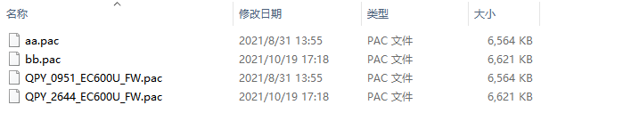
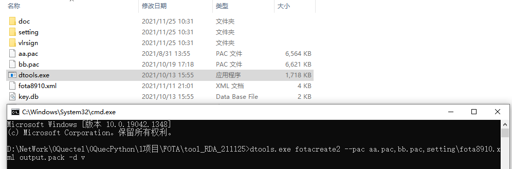
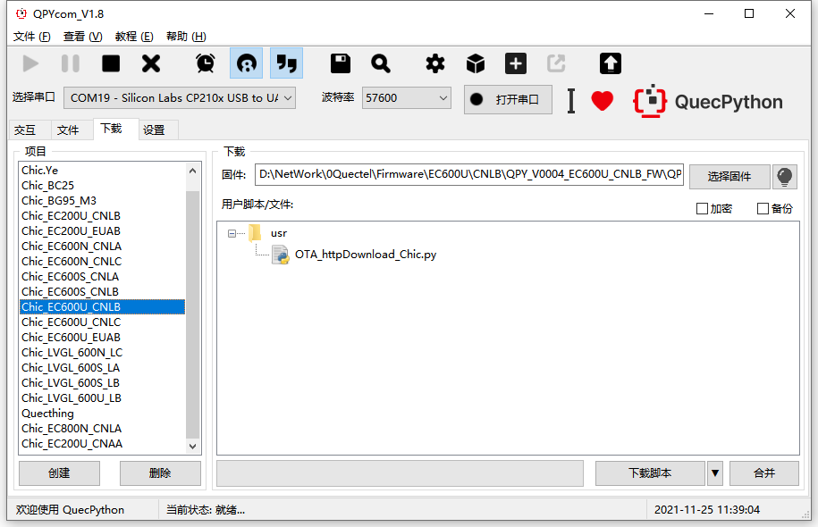

## 文档历史

**修订记录**

| Version | Date       | Author  | Change expression |
| ------- | ---------- | ------- | ----------------- |
| 1.0     | 2021-11-25 | Chic.YE | 初版              |


## RDA 固件升级

本文主要基于EC600U介绍如何升级固件，通过本文您将了解到EC600U固件差分升级的使用方法。 

适用于：EC600U_CNLB、CNLC、EUAB


## 操作步骤

1、 提取升级文件：

将‘新’‘旧’两个固件包中的.pac文件复制出来，并重命名aa.pac、bb.pac，如下图：



 

2、 制作.bin文件：

将aa.pac、bb.pac复制到FOTA工具根目录下，cmd执行一下指令：

`dtools.exe fotacreate2 --pac aa.pac,bb.pac,setting\fota8910.xml output.pack -d v`

 

执行结果：


生成供模组下载升级用的FotaFile.bin文件。

 

4、 升级文件放到http服务器中

本次实验时，下载地址为：

[http://120.197.216.227:6000/FotaFile.bin](http://120.197.216.227:6000/FotaFile.bin)


## 软件设计

```Python
import fota
import utime

DEF_URL1 = 'http://120.197.216.227:6000/FotaFile.bin'

def result(args):
    print('download status:', args[0], 'download process:', args[1])

def run():
    fota_obj = fota()  # 创建Fota对象
    print("进入升级状态......")
    res = fota_obj.httpDownload(url1=DEF_URL1, callback=result)
    if res != 0:
        return
    utime.sleep(2)

run()
```


## 下载验证

#### 软件代码

下载.py 文件到模组运行：




下载之后，手动让脚本跑起来。

等待大概5分钟结束后，升级完成后可查询： 

交互界面键入

```python
>>> uos.uname2()
(sysname='EC600U-EUAB', nodename='EC600U', release='1.13.0', version='v1.12 on Tue_Oct_19_2021_5:26:44_PM', machine='EC600U with QUECTEL', qpyver='V0002')
```

验证升级成功！