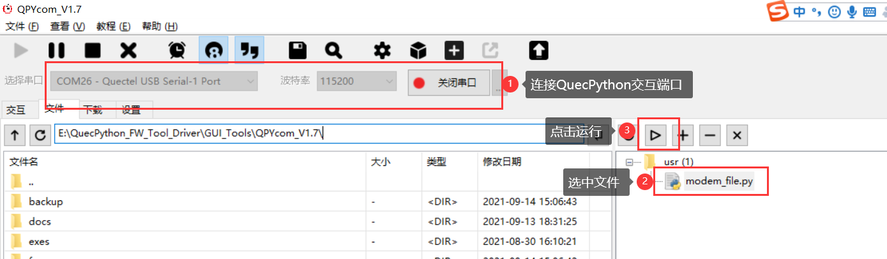
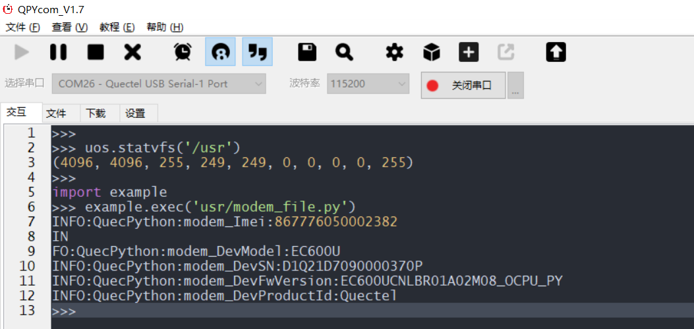

## **QuecPython modem 获取设备信息**

## 修订历史

| Version | Date       | Author     | Change expression |
| ------- | ---------- | ---------- | ----------------- |
| 1.0     | 2021-09-15 | David.Tang | Initial version   |

## 前言

本文主要基于EC600U-CN介绍如何使用QuecPython modem模块获取设备信息。通过本文您将了解到EC600U-CN线程的所有设置参数及使用方法。 

## 软件设计

软件设计主要参考官网的wiki，具体位置为：[modem_API库](https://python.quectel.com/wiki/#/zh-cn/api/QuecPythonClasslib?id=%e8%8e%b7%e5%8f%96%e8%ae%be%e5%a4%87%e7%9a%84imei)

## 交互操作

使用QPYcom工具和EC600S-CN进行交互，具体如下：

```Python
>>> import modem
>>> help(modem)
object <module 'modem'> is of type module
  __name__ -- modem
  getDevSN -- <function>
  getDevImei -- <function>
  getDevModel -- <function>
  getDevFwVersion -- <function>
  getDevProductId -- <function>
>>> from modem import *
>>> getDevSN()
'D1D20J60A0017870P'
>>> getDevImei()
'868540050393723'
>>> getDevModel()
'EC600S'
>>> getDevFwVersion()
'EC600SCNAAR01A01M16_OCPU_PY_BETA1211'
>>> getDevProductId()
'Quectel'
```

注意：

1. import modem即为让 modem模块在当前空间可见。

2. 只有import modem模块，才能使用 modem内的函数和变量。

## 下载验证

#### 软件代码

下载.py文件到EC600S-CN上运行，代码如下：

```python
import modem
import log

state = 1
log.basicConfig(level=log.INFO)   # 设置日志输出级别

log = log.getLogger("QuecPython")

def modem_msg():
    global state
    modem_Imei = modem.getDevImei()
    modem_DevModel = modem.getDevModel()
    modem_DevSN = modem.getDevSN()
    modem_DevFwVersion = modem.getDevFwVersion()
    modem_DevProductId = modem.getDevProductId()
    log.info("modem_Imei:{}".format(modem_Imei))
    log.info("modem_DevModel:{}".format(modem_DevModel))
    log.info("modem_DevSN:{}".format(modem_DevSN))
    log.info("modem_DevFwVersion:{}".format(modem_DevFwVersion))
    log.info("modem_DevProductId:{}".format(modem_DevProductId))
    state = 0

if __name__ == "__main__":
    modem_msg()
    while 1:
        if state:
            pass
        else:
            break
```

#### 硬件连接

无需硬件连接

#### 运行效果

打开QPYcom运行*modem_file.py*，如下图：



运行结果如下：



