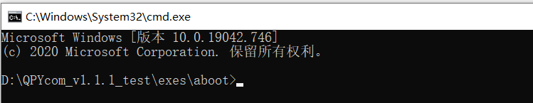
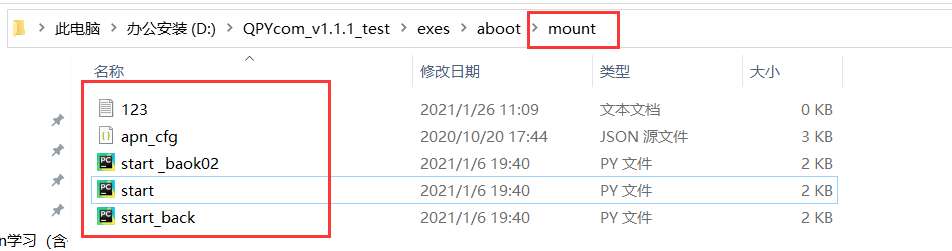
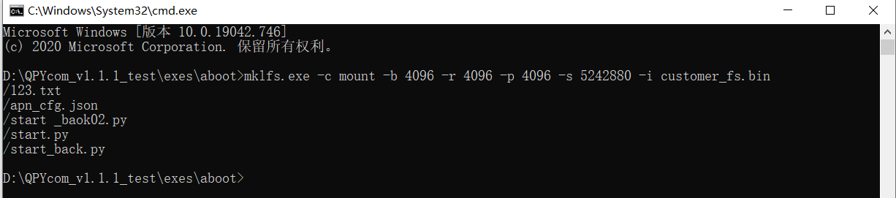
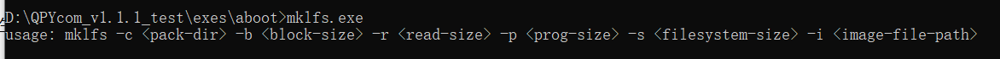
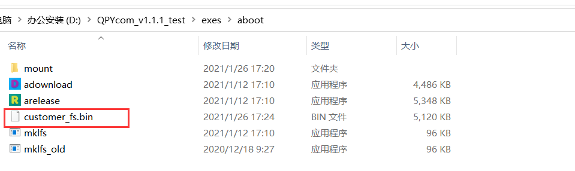
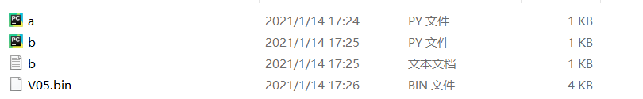
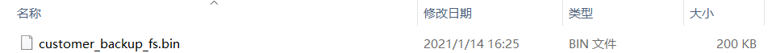
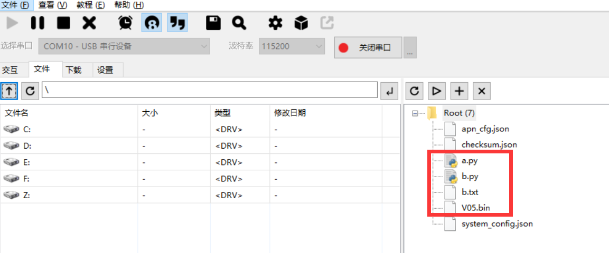

## 修订历史

| Version | Date       | Author     | Change expression |
| ------- | ---------- | ---------- | ----------------- |
| 1.0     | 2021-09-17 | David.Tang | Initial version   |

## 概述

本文主要介绍QuecPython文件系统的操作与使用。文件系统是操作系统用于明确存储设备（常见的是磁盘，也有基于NAND Flash的固态硬盘）或分区上的文件的方法和数据结构；即在存储设备上组织文件的方法。操作系统中负责管理和存储文件信息的软件机构称为文件管理系统，简称文件系统。通过本文您将了解到文件系统的操作与使用方法。 

## 如何将文件存放到文件系统中

### 通过QPYcom工具下载操作调试文件

脚本下载

对于脚本下载，方法有多种，例如：

（1）使用QPYcom的拖拽功能，直接将文件拖至模块中，

（2）使用QPYcom的脚本下载功能，可一键下载脚本至模块。

说明：具体的脚本下载操作可见《Quectel QuecPython_QPYcom工具使用说明》

文件操作

对于QuecPython文件系统如何操作，可见[uos模块](https://python.quectel.com/wiki/#/zh-cn/api/pythonStdlib?id=uos-%e5%9f%ba%e6%9c%ac%e7%b3%bb%e7%bb%9f%e6%9c%8d%e5%8a%a1)和[uio模块](https://python.quectel.com/wiki/#/zh-cn/api/pythonStdlib?id=uio-%e8%be%93%e5%85%a5%e8%be%93%e5%87%ba%e6%b5%81)

对于各类接口的举例操作如下：

```python
>>> import uos
>>> uos.getcwd()  #获取路径
'/'
>>> uos.chdir('/usr') # 改变路径
>>> uos.mkdir('QuecPython') # 在当前路径创建文件夹
>>> uos.listdir()
['apn_cfg.json', 'a.py', 'b.py', 'V05.bin', 'system_config.json', 'checksum.json', 'b.txt', 'QuecPython']
>>> uos.chdir('QuecPython')# 改变路径
>>> uos.getcwd()
'/usr/QuecPython'
>>> import uio
>>> fd = uio.open('test.py', mode='w')  #在当前路径新建文件，已写方式打开
>>> fd.write('quectel')  #写操作
7
>>> fd.close()  # 关闭文件
>>> fd = uio.open('test.py', mode='r')   # 对当前路径下的文件，已读方式打开
>>> fd.read()  #读操作  
'quectel'
>>> fd.close()
```

### 量产文件生成bin方式 

 对于固件合并的操作，实际上就是生成了customer_fs.bin，原理介绍如下：

1.找到mklfs，在QPYcom解压后的目录（QPYcom_v1.7\exes\aboot）下，在mklfs工具目录下通过cmd命令打开如下：



2.创建一个文件夹，可随意命名，本文命为mount，并在此文件夹中，放置需要合并的文件，举例如下：



3.cmd命令行操作如下



（1）.bin生成命令如上，具体命令解释如下：



（2）如上图，生成的是customer_fs.bin，默认是5 MB，即图中大小是：5242880

（3）对于customer_backup_fs.bin，默认是200 KB，即图中输出值为：20480

4.生成的customer_fs.bin文件可见mklfs的工具目录，如下截图：



## 参数保存方法

### 动态参数的保存方法

开发者在开发过程中使用的临时参数，变量，字符串定义等属于动态变化的参数，对于这些动态参数，QuecPython提供了GC内存管理模块来进行内存垃圾回收。详细可以参见QuecPython官网wiki相关说明： [gc - 内存碎片回收](https://python.quectel.com/wiki/#/zh-cn/api/pythonStdlib?id=gc-%e5%86%85%e5%ad%98%e7%a2%8e%e7%89%87%e5%9b%9e%e6%94%b6)

### 出厂参数的保存方法

关于出厂参数的保存，需要将配置的出厂参数先写入文件中，然后通过文件镜像生成.bin文件，具体操作方法可参考"量产文件生成bin方式"章节。

## 文件备份(脚本备份)

对于文件备份，需要将备份的文件与原固件合并生成新固件，然后重新烧录至模块中，具体操作步骤见如下章节。

### 制作镜像文件

对于镜像文件的制作可以参考上面的"量产文件生成bin方式 "章节，也可以参考《Quectel_EC100Y-QuecOpen_FS镜像制作_应用指导》

本文对如下几个文件说明镜像文件制作：



制作的镜像文件是：



### 镜像文件替换与烧录固件

由于"模块会对于用户区与备份区默认烧录一个已经格式化的内容为空的镜像文件"，所以需要将制作的镜像文件customer_backup_fs.bin替换原有的镜像文件，生成新的压缩包固件，使用QPYcom烧录固件，烧录步骤可参考《Quectel_QuecPython_QPYcom工具使用说明》。

### 文件更新

对于上述文件的烧录，登录QPYcom，结果如下：



交互界面操作如下：

```python
>>> import checksum 
>>> checksum.update('/usr/a.py')  

[{'name': '/usr/a.py', 'sha256': '454f048b9b584add8b6f67a86ec4ec01ce63baace41efba994881f608a227e30'}, {'name': '/usr/b.py', 'sha256': '3edc1bd333bc7f4caf33bb35e7602bafe5d85c6b6b2ca74a92588a470fbee917'}, {'name': '/usr/b.txt', 'sha256': 'cced28c6dc3f99c2396a5eaad732bf6b28142335892b1cd0e6af6cdb53f5ccfa'}, {'name': '/usr/V05.bin', 'sha256': 'e5d2dd354947292348a8fb29cdf78e4ffc05754f8e12ecf0dc0ff3783b6b8822'}]
>>> uos.listdir('usr/')
['apn_cfg.json', 'checksum.json', 'a.py', 'b.py', 'b.txt', 'V05.bin', 'system_config.json']
>>> uos.listdir('/bak/usr/')
['test.txt', 'a.py', 'b.py', 'b.txt', 'V05.bin']
>>> 
```

操作说明：

（1）对于更改customer_backup_fs.bin后的烧录如上图所示

（2）如果更新usr目录下的文件且希望下次上电后可以继续运行的话，需要使用checksum.update接口更新checksum.json文件。

（3）文件备份的操作就是保留合并的文件，防止后面误删文件，导致程序删除，无法恢复。