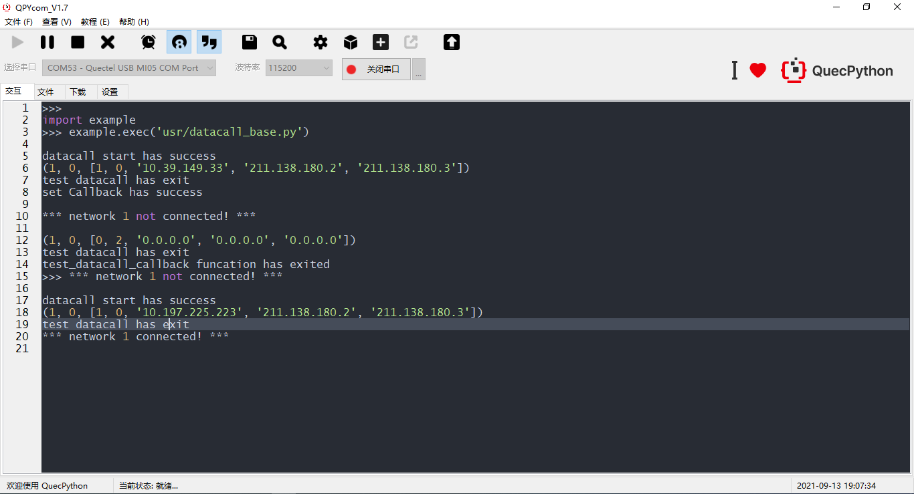

## 修订记录

| 版本 | 日期       | 作者   | 变更表述     |
| ---- | ---------- | ------ | ------------ |
| 1.0  | 2021-09-13 | Kayden | 初始版本修订 |


## QuecPython_dataCall数据拨号

**模块功能：**

提供数据拨号相关接口。启动；配置；查询终端通过何种接入方式来访问何种网络。

具体的API 详解请参考[Quecpython - dataCall - 数据拨号](https://python.quectel.com/wiki/#/zh-cn/api/QuecPythonClasslib?id=datacall-数据拨号)

## 数据拨号简介

简单理解， 数据拨号即为通过拨号的方式和服务器建立连接，获取网络访问许可过程。 对于终端设备来说就是配置APN。

### 什么是APN

APN指一种网络接入技术，是终端入网时必须配置的一个参数，它决定了终端通过哪种接入方式来访问网络。

对于用户来说，可以访问的外部网络类型有很多，例如：[Internet](https://baike.baidu.com/item/Internet/272794)、[WAP网站](https://baike.baidu.com/item/WAP网站/3419865)、集团企业内部网络、行业内部专用网络。而不同的接入点所能访问的范围以及接入的方式是不同的，网络侧如何知道终端激活以后要访问哪个网络从而分配哪个网段的IP呢，这就要靠APN来区分了，即APN决定了用户的终端通过哪种接入方式来访问什么样的网络。

 [APN Configuration](https://prepaid-data-sim-card.fandom.com/wiki/APN_Configuration) 

 [What is Access Point Name (APN)](https://1ot.mobi/resources/blog/iot-hacking-series-3-what-is-access-point-name-apn-and-how-it-works)

所有运营商都使用特定的APN（Access Point Name，接入点名称）。这通常是您的SIM卡预先配置的，但必要时，您需手动进行调整。

### APN的含义

APN决定了终端通过哪种接入方式来访问网络，用来标识[GPRS](https://baike.baidu.com/item/GPRS/107439)的业务种类。

APN分为两大类：

- [WAP](https://baike.baidu.com/item/WAP/207452)业务。
- [WAP](https://baike.baidu.com/item/WAP/207452)以外的服务，比如：连接因特网。

从运营商角度看，APN就是一个逻辑名字，APN一般都部署在GGSN设备上或者逻辑连接到GGSN上，用户使用GPRS上网时，都通过[GGSN](https://baike.baidu.com/item/GGSN/6041769)代理出去到外部网络，因此，APN设置、过滤、统计等，就成为一个对GPRS计费、GPRS资费有重要参考价值的参数之一（因为APN可以区分一个业务或者外部网络）。

APN的完整说明在3GPP规范TS23.003 Clause 9中进行了详细定义。

### APN的构成

APN接入点名称由两部分组成：

- 网络标识符

- 运营商标识符

运营商标识符又由其他两个部分组成：  

- 移动网络代码（MNC）

- 移动国家代码（MCC）

### APN的类型

我们可以根据APN是连接到公共网络还是专用网络以及IP地址的分配方式来划分APN，有以下四种不同的类型：

- **公用的APN-**通常简称为“ APN”。使用公用APN连接到网关的设备会动态获得IP地址，以便大部分访问互联网；

- **具有静态IP的公用APN-**网关根据公共网络的可用IP池为设备分配静态IP地址；

- **专用APN-**这也被认为是“带有VPN的APN”。具有专用APN配置的设备可以通过网关连接到自己的内部网络；

- **具有静态IP的专用APN-**网关根据专用网络的可用IP池为设备分配静态IP地址。

当我们比较公用APN和专用APN时，我们可以看到后者甚至不需要互联网连接。专用APN永远不允许其访问公共互联网，而同时又保持其在蜂窝网络基础架构上，从而确保了安全的数据处理。

### 配置APN

对于QuecPython，可使用SIM卡默认APN或者手动配置APN，也可以调用API函数配置APN。


## 快速开始

### 操作流程

1. 使用链路拨号，获取进行链路激活；
2. 获取IP信息等基本数据；
3. 注册断网回调函数， 在回调函数里面，判断网络状态，进入重拨等操作。

### 交互实验

```python
>>> import dataCall
>>> import net
>>> dataCall.setApn(1, 0, "3gnet.mnc001.mcc460.gprs", "", "", 0)
0
>>> dataCall.start(1, 0, "3gnet.mnc001.mcc460.gprs", "", "", 0)
0
>>> def nw_cb(args):
        pdp = args[0]
        nw_sta = args[1]
        if nw_sta == 1:
            print("*** network %d connected! ***" % pdp)
        else:
            print("*** network %d not connected! ***" % pdp)
            
>>> dataCall.setCallback(nw_cb)
0
>>> net.setModemFun(4)  # 进入飞行模式
0
>>> *** network 1 not connected! *** # 进入飞行模式导致断网，通过回调告知用户
>>> net.setModemFun(1)  # 退出飞行模式
0
>>> *** network 1 connected! *** # 退出飞行模式，自动拨号，等待联网成功，通过回调告知用户
```


### 代码实验

1. 首先链路激活；
2. 打印IP信息等；
3. 注册回调函数；
4. 使用飞行模式模拟离线；
5. 在回调函数中重新拨号。

 <a href="code/datacall_base.py" target="_blank">下载代码</a>

**注意：**运行此代码想要正确观察现象需要插入可以使用的SIM卡。

```python
import dataCall
import net
import utime as time


g_net_status = False


def callback(args):
    pdp = args[0]
    nw_sta = args[1]
    if nw_sta == 1:
        g_net_status = True
        print("*** network %d connected! ***" % pdp)
    else:
        g_net_status = False
        print("*** network %d not connected! ***" % pdp)
        # 重新进入
        test_datacall_module()


def test_datacall_module():
    # 拨号
    ret = dataCall.start(1, 0, "3gnet.mnc001.mcc460.gprs", "", "", 0)
    if ret == 0:
        print("datacall start has success")
        g_net_status = True
    # 获取IP地址等信息
    Info = dataCall.getInfo(1, 0)
    print(Info)
    print("test datacall has exit")
    pass


def test_datacall_callback():
    test_datacall_module()
    # 注册回调中断
    ret = dataCall.setCallback(callback)
    if ret == 0x00:
        print("set Callback has success")
    net.setModemFun(4)  # 进入飞行模式
    time.sleep_ms(1000)
    net.setModemFun(1)  # 重新进入正常模式
    print("test_datacall_callback funcation has exited")
    pass


if __name__ == "__main__":
    test_datacall_callback()

```

运行结果：



## 参考资料

[What is Access Point Name (APN)](https://1ot.mobi/resources/blog/iot-hacking-series-3-what-is-access-point-name-apn-and-how-it-works)

[APN Configuration](https://prepaid-data-sim-card.fandom.com/wiki/APN_Configuration) 

[Quecpython - dataCall - 数据拨号](https://python.quectel.com/wiki/#/zh-cn/api/QuecPythonClasslib?id=datacall-数据拨号)

