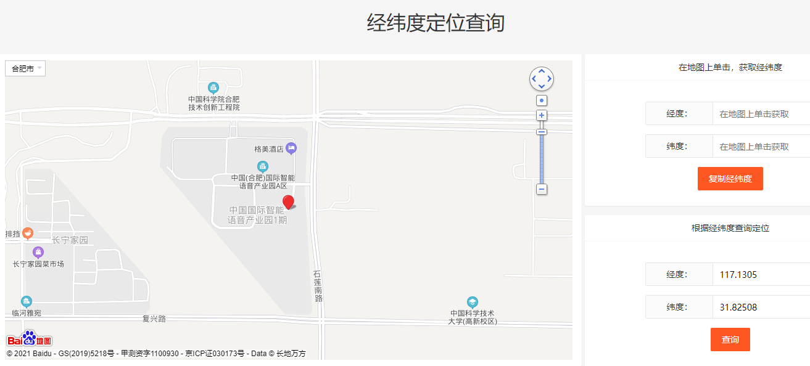

## 文档历史

**修订记录**

| **版本** | **日期**   | **作者** | **变更表述** |
| -------- | ---------- | -------- | ------------ |
| 1.0      | 2021-09-07 | FAE      | 初始版本     |
| 1.1      | 2021-09-08 | Chic     | 增加图片     |


## QuecPython_cellLocator基站定位

本片文章主要简介QuecPytho_cellLocator 基站定位的使用。

**模块功能：**

提供基站定位接口，获取终端坐标信息。

**对应API:**

- cellLocator.getLocation(serverAddr, port, token, timeout, profileID)

具体的API 详解请参考 [cellLocator - 基站定位](https://python.quectel.com/wiki/#/zh-cn/api/QuecPythonClasslib?id=celllocator-基站定位)


## 定位概述

定位是指通过特定的方法来获取用户终端的位置信息(经纬度坐标)的技术或服务。

常见的定位技术有两种：一种是基于GPS的定位，一种是基于移动运营网的基站定位。基于GPS的定位方式是利用GPS定位模块将自己的位置信号发送到定位后台来实现定位的。基站定位则是利用基站与终端之间的距离来确定终端位置的。QuecPython_cellLocator基站定位便是属于基站定位一种。

基站定位的大致原理为：移动终端通过运营商的网络(如GSM网)测量不同基站的下行导频信号时间，得到不同基站下行导频的TOA(Time of Arrival，到达时刻)或TDOA(Time Difference of Arrival，到达时间差)，根据该测量结果并结合基站的坐标，一般采用三角公式估计算法，获取移动终端用户的位置信息(经纬度坐标)，在电子地图平台的支持下，为用户提供相应定位位置。实际的位置估计算法需要考虑多基站(3个或3个以上)定位的情况，因此算法要复杂很多。一般而言，移动台测量的基站数目越多，测量精度越高，定位性能改善越明显。


## QuecPython_cellLocator 特性

QuecPython_cellLocator基站定位不需要终端具有GPS定位能力，无需任何额外硬件支持，但是精度很大程度依赖于基站的分布及覆盖范围的大小。定位精准度大概500m~1500m(因基站密度及数据库数量而异)。此外还可以利用Wi-Fi在小范围内辅助定位，定位精准度约50m。

由于是基站定位，需要基站信号覆盖。目前国内4G信号已基本覆盖，2G网络暂时间依旧可以使用，但面临退网风险，3G网络只有电信还没退网，也列入退网计划。在使用该功能前需先对使用地信号覆盖有所了解。


##  快速开发

### 交互实验

进行本次实验， 需要先确定SIM卡状态。 具体请参考SIM模块的文档。

我们使用交互命令来获取当前的坐标信息。

```python
>>> import cellLocator
>>> cellLocator.getLocation("www.queclocator.com", 80, "1111111122222222", 8, 1)
(117.1305, 31.82508, 550)
# 上面使用的密钥仅为测试密钥
```




### 代码实验

计算当前位置到北京首都的距离

```python
import cellLocator
from math import sin, asin, cos, radians, fabs, sqrt

EARTH_RADIUS = 6371           # 地球平均半径，6371km


def hav(theta):
    s = sin(theta / 2)
    return s * s


def get_distance_hav(lat0, lng0, lat1, lng1):
    "用haversine公式计算球面两点间的距离。"
    # 经纬度转换成弧度
    lat0 = radians(lat0)
    lat1 = radians(lat1)
    lng0 = radians(lng0)
    lng1 = radians(lng1)

    dlng = fabs(lng0 - lng1)
    dlat = fabs(lat0 - lat1)
    h = hav(dlat) + cos(lat0) * cos(lat1) * hav(dlng)
    distance = 2 * EARTH_RADIUS * asin(sqrt(h))

    return distance


def test_cellLocator():
    # 测试地点
    lon1, lat1 = (22.599578, 113.973129)  # 深圳野生动物园(起点）
    lon2, lat2 = (39.9087202, 116.3974799)  # 北京天安门(1938.4KM)
    d2 = get_distance_hav(lon1, lat1, lon2, lat2)
    print(d2)
    # 获取当前位置
    # (latitude, longtitude, accuracy)
    ret = cellLocator.getLocation(
        "www.queclocator.com", 80, "1111111122222222", 8, 1)
    lon3, lat3 = ret[1], ret[0]
    d2 = get_distance_hav(lon3, lat3, lon2, lat2)
    print(d2)


if __name__ == "__main__":
    test_cellLocator()

```


## 参考资料

[cellLocator - 基站定位](https://python.quectel.com/wiki/#/zh-cn/api/QuecPythonClasslib?id=celllocator-基站定位)

## 配套代码

<!-- * [下载代码](code/cellLocator_base.py) -->
 <a href="code/cellLocator_base.py" target="_blank">下载代码</a>

