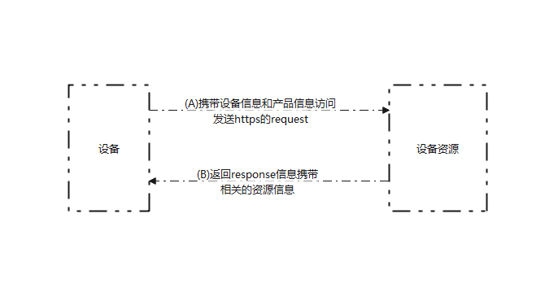

## 一、修订历史

| Version | Date       | Author    | Change expression |
| ------- | ---------- | --------- | ----------------- |
| 1.0     | 2021-12-16 | Jaxsen.Xu | Initial version   |


## 二、前言

本文主要提供产品开发中, 在过往的产品中, 我们都是通过烧录的方式来解决的, 由于我们是通过蜂窝数据模块,  我们可以https来解决认证和授权拿到设备的三元组等信息


## 三、流程介绍

​    设备接入主要连接设备




- (A) 通过imei和一些信息访问客户服务器
- (B) 获取客户的三元组信息


## 四、API介绍

组件代码point_access.py

```python
import request


class PointAccess(object):
    def __init__(self):
        self.device_config = {
            "device": {
                'productKey': '',
                'productSecret': None,
                'deviceName': '',
                'deviceSecret': ''
            },
            'connect': {
                'qos': 1,
                'host': '',
                'cleanSession': 1
            },
        }
        self.success_code = "00000"

    def request(self, url, data, **kwargs):
        headers = kwargs.get("headers", {})
        headers['Content-Type'] = 'application/json'
        try:
            resp = request.post(url, json=data, headers=headers)
        except Exception as e:
            return "77777"
        config = resp.json()
        code = config.get("code", "99999")
        if code == self.success_code:
            self.device_config["device"] = config["result"]["device"]
            self.device_config["device"]["productSecret"] = self.device_config["device"].get("productSecret", None)
            self.device_config["connect"] = config["result"]["connect"]
        return code
```


### 一、初始化设备接入

> **from point import PointAccess**
>
> **point_access = PointAccess()**

设备初始化point_access实体类用作后面的设备数据请求


### 二、获取云平台连接信息

> **point_access.request(url, data, \**kwargs)**

通过request发送post请求服务器, 获取云平台连接信息

- 参数

| 参数   | 类型   | 是否必须 | 说明                                                         |
| ------ | ------ | -------- | ------------------------------------------------------------ |
| url    | string | 是       | https类型的服务器地址                                        |
| data   | dict   | 是       | 携带请求的发送给服务器认证的信息, 客户基于自身情况编写       |
| kwargs |        | 否       | 可携带headers, headers默认采用application/json不许用户自己编写 |

- 返回值

| 返回值 | 说明                 |
| ------ | -------------------- |
| 00000  | 配置获取成功         |
| 77777  | 从服务器获取配置错误 |
| 99999  | 连接未知错误         |


#### 一、请求服务器的返回值格式

```json
{
    "code": "00000",
    "result": {
        "device": {
            "productKey": "",
            "deviceName": "",
            "deviceSecret": ""
        },
        "connect": {
            "qos": 1,
            "host": "",
            "cleanSession": 1
        }
    }
}
```

**code返回值参数**

| 返回值参数 | 类型   | 说明                          |
| ---------- | ------ | ----------------------------- |
| code       | string | 返回的结果值, 成功则为"00000" |

**result结果中的device**

| 返回值参数   | 类型   | 说明     |
| ------------ | ------ | -------- |
| productKey   | string | 产品key  |
| deviceName   | string | 设备名称 |
| deviceSecret | string | 设备秘钥 |

**result结果中的connect**

| 返回值参数   | 类型   | 说明                                                         |
| ------------ | ------ | ------------------------------------------------------------ |
| qos          | int    | MQTT消息服务质量（默认0，可选择0或1）0：发送者只发送一次消息，不进行重试 1：发送者最少发送一次消息，确保消息到达Broker |
| host         | string | 连接云服务器地址                                             |
| cleanSession | int    | 可选参数，一个决定客户端类型的布尔值。 如果为True，那么代理将在其断开连接时删除有关此客户端的所有信息。 如果为False，则客户端是持久客户端，当客户端断开连接时，订阅信息和排队消息将被保留。默认为False |


### 三、获取设备接入的信息

> **point_access.device_config**

获取连接服务器的设备信息, 设备信息如上概述


### 四、使用示例

```python
from point import PointAccess

# 所要请求的服务器和信息
url = ""
data = {}

point_access = PointAccess()
code = point_access.request(url, data)
if code != "00000"
    # 设备认证失败处理
	pass

print(point_access.device_config)
```


## 五、总结

此功能是为了,  给设备认证做使用, 客户可以通过我们的API直接设备认证, 授权获取连接信息, 并连接云平台, 但是需要客户自己去按我们设计的接口去返回我们对应的数据


