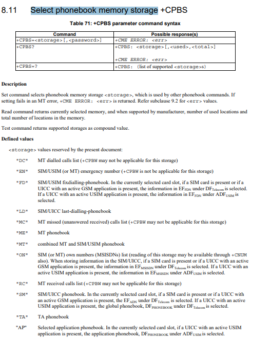

## 修订记录

| 版本 | 日期       | 作者       | 变更表述     |
| ---- | ---------- | ---------- | ------------ |
| 1.0  | 2021-09-13 | David.Tang | 初始版本修订 |

## 前言

本文主要简介QuecPython SIM卡模块的使用。 具体的API 详解请参考[QuecPython_SIM](https://python.quectel.com/wiki/#/zh-cn/api/QuecPythonClasslib?id=sim-sim%e5%8d%a1)

## SIM卡基本概述

SIM 分为手机卡和物联网卡。区别就是物联网卡没有电话号码不能收发短信，手机可以发短信。 常见的是手机卡。

第二代标准的Mini卡，国内用户俗称的大卡。

第三代标准的Micro卡，俗称小卡。

第四代标准的Nano卡。


需要的是第四代标准的 Nano 卡。 

## 快速开始
获取sim 卡信息之前，请首先确认sim卡状态是否完好，
```python
import sim
# 返回状态1 表示状态正确，其他错误码，请查阅 WIKI SIM API
sim.getStatus()
```
### 获取imsi
IMSI全称为 Internation Mobile Subscriber Identity，即国际移动用户识别码。

-  前三位数字代表移动国家代码（MCC）。
-  接下来的两位或三位数字代表移动网络代码（MNC）。E.212允许使用三位数的MNC代码，但主要在美国和加拿大使用。
-  接下来的数字代表移动用户识别号（MSIN）。
```python
import sim
sim.getImsi()
```
### 获取iccid
ICCID全称为Integrated Circuit Card Identifier，即集成电路卡识别码。

- 可以简单理解为SIM卡的卡号（身份证号）。

- 编码格式为：XXXXXX 0MFSS YYGXX XXXX。

- 前六位运营商代码：

  中国移动的为：898600；898602；898604；898607 ，

  中国联通的为：898601、898606、898609，

  中国电信898603、898611。
```python
import sim
sim.iccid()
```

### PIN码操作
    PIN码(PIN1)是电信名词，全称**Personal Identification Number**。是指SIM卡的个人识别密码.
手机的PIN码是保护SIM卡的一种安全措施，防止别人盗用SIM卡，如果启用了开机PIN码，那么每次开机后就要输入**4-8**位数PIN码。当输入PIN码错误超过三次时，将自动锁卡保护。解锁需要使用PUK码拨打运营商客服热线.需要注意的是，如果输入三次PIN码错误，手机便会自动锁卡，并提示输入PUK码解锁，这个时候已经接近了危险的边缘，如果你不知道你的PUK码就暂时不要动了，拿上服务密码拨打客服热线，客服会告诉你初始的PUK码，输入PUK码之后就会解锁PIN，就可以重置密码了。如果擅自修改了PIN码，一定要牢记。

#### PIN1码
    PIN1码是个人识别码。是SIM卡内部的一个存储单元，通过手机设置。
开机时会要求输入PIN1码，错误地输入PIN1码3次，将会导致“锁卡”现象。此时需要运营商提供PUK码在手机键盘上输入，就可以解锁。如果错误输入PUK码10次，就会“烧卡”，您必须带机主有效证件到运营网络的营业厅补卡。

#### PIN2码
    您的手机上如果显示“PIN2码限制通话”可能是由于您开启了PIN2码的相关功能，
但由于网络暂不支持PIN2码的相关功能，即便开启也不能使用其功能。如不慎将PIN2码锁死，也不会影响手机的正常使用，请您携带机主的有效证件到运营服务商营业厅办理免费解锁服务。启用sim卡PIN码验证，开启后需要输入正确的PIN验证成功后，sim卡才能正常使用。只有3次输入PIN码机会，3次都错误，sim卡被锁定，需要PUK来解锁。

#### 使能验证Pin码
```python
import sim
# 1234 修改成为你的 Pin码， 一般是 4到8位，此类操作，请慎重。
sim.enablePin("1234")
# 在使能 pin码以后，才能进行验证 Pin
sim.verifyPin("1234")
# 关闭Pin码
sim.disablePin("1234")
```
#### 修改PIN码
```python
import sim
# 1234 为 久的PIN码， 4321 为 新的PIN码
sim.changePin("1234", "4321")
```

### 重置pin码-PUK码
当错误输入Pin码次数过多以后，不能再输入PIN码。此时需要使用PUK码来解锁。

#### PUK1码
PUK码(PUK1)由8位数字组成 ，这是用户无法更改的，只有补换SIM卡后PUK码才会变更。当手机PIN码被锁，并提示输入PUK码时。千万不要轻举妄动，因为PUK码只有10次输入机会，10次都输错的话，SIM卡将会被永久锁死，也就是报废。部分SIM卡的PUK码是用户在购卡时随卡附带的。

#### PUK2码
PIN2码是电信局用于计费的，一般不向用户提供 。如果输入三次错误，手机会需要用PUK2码解锁，过程与先前介绍的PIN码、PUK码相同。不过这两种密码与网络计费及SIM卡内部资料的修改有关，所以不会公开，而且即便PIN2密码锁死，也不会影响手机的正常使用。**因此，PIN2码和PUK2码不必去刻意理会**。

#### 解锁PIN码
```python
import sim
# 12345678 为 PUK码， 0000 为新的 PIN码
sim.unblockPin("12345678", "0000")
```

### 读写SIM内存区域

####  Phonebook Memory Storage
Phonebook Memory Storage即为SIM卡电话薄存储区域。详情可参考 [ts_127007v100300p.pdf](https://www.etsi.org/deliver/etsi_ts/127000_127099/127007/10.03.00_60/ts_127007v100300p.pdf)


```python
>>> import sim
>>> sim.getStatus()
1
>>> sim.getImsi()
'460110847679419'
>>> sim.getIccid()
'89860319747555431000'
# 写电话薄，
>>> sim.writePhonebook(9, 1, 'Tom', '18144786859')
0
>>> sim.writePhonebook(9, 2, 'z', '18144786859')
0
>>> sim.readPhonebook(9, 1, 4, "")
(1, [(1, 'Tom', '18144786859')])
>>> sim.readPhonebook(9, 2, 4, "")
(1, [(2, 'z', '18144786859')])
```
## 参考资料

**[ts_127007v100300p.pdf](https://www.etsi.org/deliver/etsi_ts/127000_127099/127007/10.03.00_60/ts_127007v100300p.pdf)** 

**[Quecpython sim - SIM卡库]([QuecPython 类库 (quectel.com)](https://python.quectel.com/wiki/#/zh-cn/api/QuecPythonClasslib?id=sim-sim卡))**

