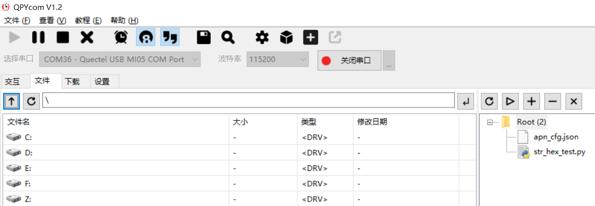
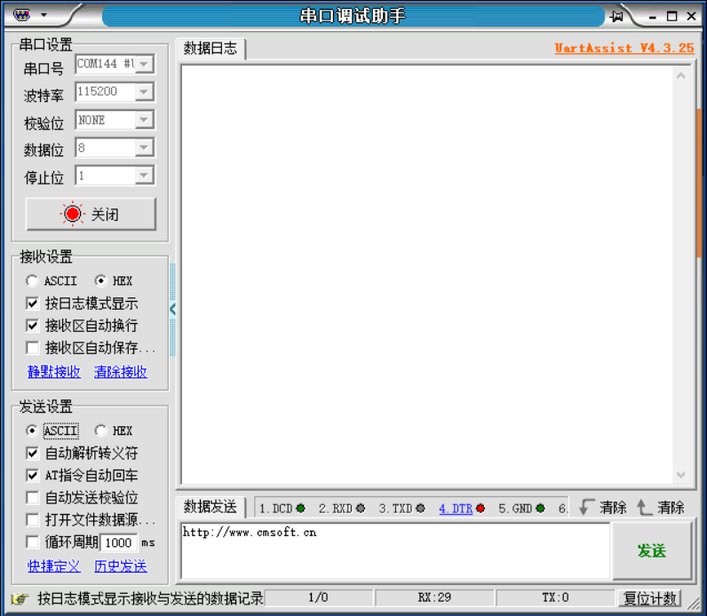
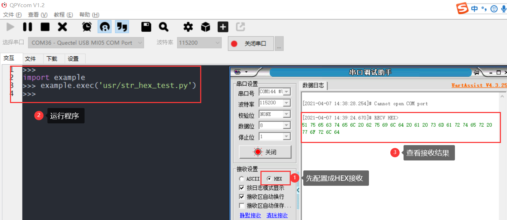
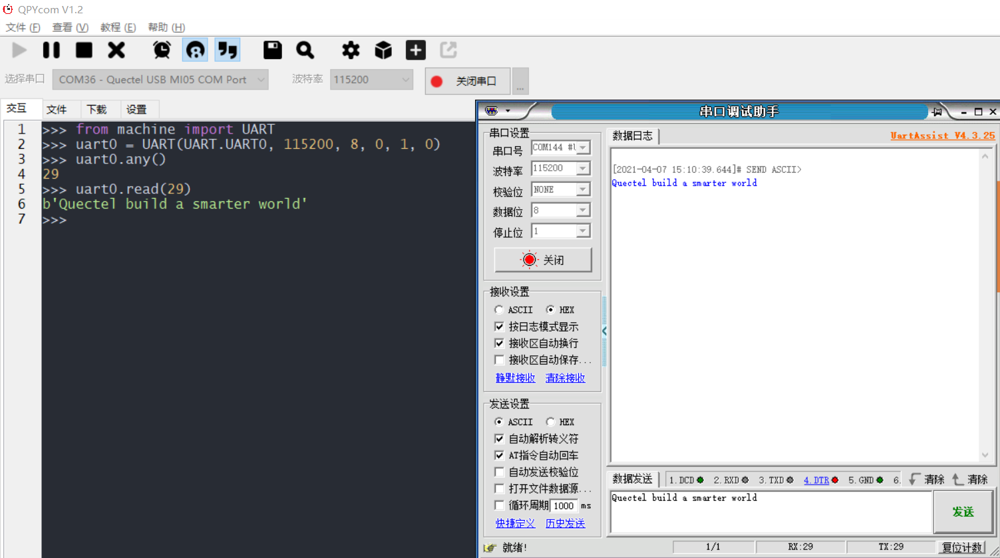

## 修订历史

| Version | Date       | Author     | Change expression |
| ------- | ---------- | ---------- | ----------------- |
| 1.0     | 2021-09-28 | David.Tang | Initial version   |

对于字符串与十六进制之间的转换需求，特编写这篇文档，详细介绍相关知识。

## 位运算

首先介绍位运算，计算机内所有的数都以二进制存储，位运算就是对二进制位的操作。在python中主要包括：按位与运算符、按位或运算符、 按位异或运算符、按位取反运算符、左移动运算符、右移动运算符。具体的介绍可参考：[位运算](https://blog.csdn.net/csdn_edition/article/details/109402978)

### 按位与运算符

 按位与运算符&：参与运算的两个值,如果两个相应位都为1,则该位的结果为1,否则为0。举例说明如下：

```python
>>> a= 60
>>> b= 13
>>> a & b
12
```

### 按位或运算符

按位或运算符|：只要对应的二个二进位有一个为1时，结果位就为1。

```python
>>> a=60
>>> b= 13
>>> a | b
61
```

### 按位异或运算符

按位异或运算符：当两对应的二进位相异时，结果为1

```python
>>> a=60
>>> b= 13
>>> a ^ b
49
```

### 按位取反运算符

 按位取反运算符：对数据的每个二进制位取反,即把1变为0,把0变为1 。**~x** 类似于 **-x-1**

```python
>>> a=60
>>> ~a 
-61
```

### 左移动运算符

左移动运算符：运算数的各二进位全部左移若干位，由 **<<** 右边的数字指定了移动的位数，高位丢弃，低位补0。

```python
>>> a=60
>>> a << 2 
240
```

### 右移动运算符

右移动运算符：把">>"左边的运算数的各二进位全部右移若干位，**>>** 右边的数字指定了移动的位数

```python
>>> a=60
>>> a >> 2 
15
```

## 字符串与十六进制

### 字符串与十六进制转换的封装

对于字符串与十六进制之间的相互转换，由于python没有对应的封装，这里封装一个类供大家使用：

```python
str_test = 'Quectel build a smarter world'
class String:
    def to_hex(a, b=""):  # 可实现的功能：转成HEX格式，可选择加上需要的分隔符
        Hex = ''.join([hex(ord(c)).replace('0x', b) for c in a])
        return Hex,len(a)

    def from_hex(a,b=''): # 可实现的功能：转成STR，如果有分隔符，可以添加分割符参数转换
        Str = ''.join([chr(int(c.replace(b, ''), 16)) for c in [a[i:i+2+len(b)] for i in range(0, len(a), 2+len(b))]])
        return Str

hex_test = String.to_hex(str_test)
print(type(hex_test[0]))
print(hex_test[1])
print(hex_test)

hex_test = str(hex_test[0])
str_test = String.from_hex(hex_test)
print(str_test)
```

### 字符串与十六进制转换的应用

当然转换后的HEX无法串口直接接收解析，仍需要一定的转换，下面基于EC600SCNLB模组做个简单的实验

```python
str_test = 'Quectel build a smarter world'
def str_to_hex(s):
    list_hex = ' '.join([hex(ord(c)) for c in s]).split()
    list = [int(i,16) for i in list_hex]
    bytearr = bytearray(list)
    return bytearr
hex_test = str_to_hex(str_test)
```

​	1.编写如下代码并命名为str_hex_test.py。

```python
from machine import UART
uart0 = UART(UART.UART0, 115200, 8, 0, 1, 0)
str_test = 'Quectel build a smarter world'
def str_to_hex(s):
    list_hex = ' '.join([hex(ord(c)) for c in s]).split()
    list = [int(i,16) for i in list_hex]
    bytearr = bytearray(list)
    return bytearr
hex_test = str_to_hex(str_test)
uart0.write(hex_test)
```

​	2.下载上述文件到模组中运行，并打开串口调试工具（此处使用UartAssist）





3.运行程序，在串口工具中查看结果



**Tips：**

如果使用ASCII接收的话，就会显示字符串形式

​	4.对于模组的串口接收：无论串口工具发送ASCII或者HEX数据，串口读取都是bytes型数据



## 编解码

对于编解码，常见的有ASCII、UTF-8、GBK等等，python已经有了对应的封装，这里简单的介绍一下，也可以参考 [encode and decode](https://blog.csdn.net/qq_26442553/article/details/94440502)：

```python
import ubinascii as binascii
import ustruct as struct

def example(express, result=None):
    if result == None:
        result = eval(express)
    print(express, ' ==> ', result)
if __name__ == '__main__':
    print('编解码:')
    print("str to utf-8", end=': ');
    example("u'小明'.encode('utf-8')")
    print("utf-8 to str", end=': ');
    s_utf = b'\xe5\xb0\x8f\xe6\x98\x8e'
    example("s_utf.decode('utf-8')")
    print("类似的还有encode('gbk')，decode('gbk'),encode('gb2312'),decode('gb2312')")

```

## 二进制与ASCII转换、打包与解压

对于[二进制与ASCII转换](https://python.quectel.com/wiki/#/zh-cn/api/pythonStdlib?id=ubinascii-二进制与ascii转换)和[ustruct - 打包和解压原始数据类型](https://python.quectel.com/wiki/#/zh-cn/api/pythonStdlib?id=ustruct-打包和解压原始数据类型)，在模组的固件中已经有了封装。