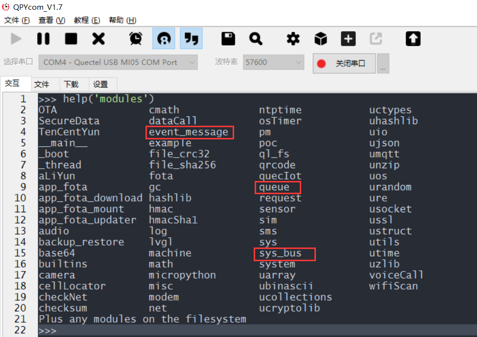
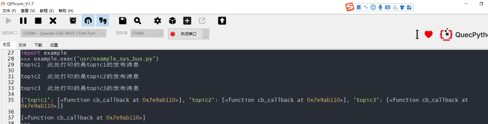
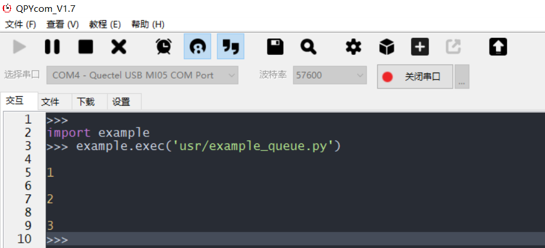
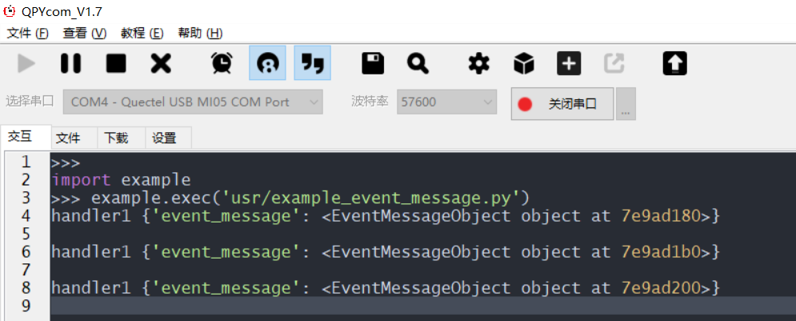

## 修订历史

| Version | Date       | Author     | Change expression |
| ------- | ---------- | ---------- | ----------------- |
| 1.0     | 2021-09-30 | David.Tang | Initial version   |

## 前言

目前支持的队列与消息总线有sys_bus、Queue普通队列、event-manage消息队列，下面详细介绍之间的区别与示例。

功能支持确认，如果在应用之前，不确定当前版本是否支持，可以使用下面方法确认：



如上截图表明此固件支持所有的队列与消息总线。

## sys_bus消息总线

sys_bus消息总线主要运用于发布订阅，无需服务器即可实现，示例代码如下：

```python
import sys_bus
import utime 
def cb_callback(topic, msg):
    print(topic, msg)
# 支持一个topic 可以注册多个订阅函数
sys_bus.subscribe("topic1", cb_callback)
sys_bus.subscribe("topic2", cb_callback)
sys_bus.subscribe("topic3", cb_callback)


"发布后订阅者会收到消息"
sys_bus.publish("topic1", " 此处打印的是topic1的发布消息")
utime.sleep(2)
sys_bus.publish("topic2", " 此处打印的是topic2的发布消息")
utime.sleep(2)
sys_bus.publish("topic3", " 此处打印的是topic3的发布消息")
utime.sleep(2)

print(sys_bus.sub_table())
# 返回 {"topic1": set(cb_callback...)}
utime.sleep(2)
print(sys_bus.sub_table("topic1"))
# 返回 set(cb_callback...)

sys_bus.unsubscribe("topic1", cb_callback)
#由于上面取消了订阅callback,所以下面的发布不会进入之前的callback，即：此时仍可以收到订阅消息，但是没有callback
sys_bus.publish("topic1", " 此处打印的是topic1的发布消息")

sys_bus.unsubscribe("topic1")
#由于上面取消了topic1的订阅,所以下面的发布不会收到任何消息
sys_bus.publish("topic1", " 此处打印的是topic1的发布消息")
```

运行的效果如下图所示：



效果解释：

当线程A订阅了某个主题C的话，那么另一个线程B向主题C发送消息，此时线程A就会收到主题C的消息

## Queue普通队列

Queue普通队列主要用于线程之间的通信，示例代码如下：

```python
import _thread
from queue import Queue
import utime
# 初始化队列
q = Queue(maxsize=100)
def get():
    while True:
# q.get 会阻塞等待消息过来每当有q.put执行完后 q.get会受到相关信号,解除阻塞往下执行
        item = q.get()
        print(item)
# 开启线程在哪等待消息
_thread.start_new_thread(get,())
# put消息到队列
q.put(1)
utime.sleep(2)
q.put(2)
utime.sleep(2)
q.put(3)
```

运行的效果如下图所示：

效果解释：

当线程A创建了queue，会一直阻塞等待get，直到另外一个线程B进行put，此时线程A会get数据。

## event-manage消息队列

event-manage消息队列主要用于层级的消息派播,观察者模式的实现，支持提供消息队列的就派发服务、同步派发和异步派发机制、提供观察者模式支持  示例代码如下：

```python
from event_message import Event
import utime
"""
1. 初始化事件
2. 初始化事件管理器
3. 注册事件到事件管理器中
4. 开启事件管理器
5. 添加事件处理器
6. 派发数据
"""
from event_message import Event, EventManager
# 初始化事件和事件管理器
event = Event("test")
event_manager = EventManager()
# 注册事件
event_manager.register_event(event)
# 开启事件管理器
event_manager.start()
# 添加事件处理器, 这里注意可以批量注解不同的事件类型
@event.add_handler_via()
def handler(**kwargs):
    em = kwargs["event_message"]
    """
    第一种获取数据的方法
    kwargs:{
        "event_message":EventMessageObject
    }
    EventMessageObject 有四个属性
        event_name
        msg
        event
        callback
        提供了自己获取还有组合获取组合获取可调用下列方法,model_to_dict()会获取组合的字典内容如下
        {
            'name': 'test',
            'event': event_object,
            'msg': '1111',
            'callback': None
        }
    """
    
    print("handler1 {}".format(kwargs))
    """
    1. 第一种属性获取方式
        # 获取事件的名称
            event_name = em.event_name
        # 获取事件的消息内容
            msg = em.msg
        # 获取由来的事件
            ev = em.event
        # 获取传进来的callback不传默认为None
            cb = em.callback
    """
    """
    2. 第二种属性值获取方式(推荐)
        data_map = em.model_to_dict()
        数据格式如下
            {
                'name': 'test',
                'event': event_object,
                'msg': '1111',
                'callback': None
            }
    """
# 异步派发数据, 非阻塞
while True:
    event.post(message="1111")
    utime.sleep(2)
```

运行的效果如下图所示：



效果解释：

程序处于循环异步派发数据


