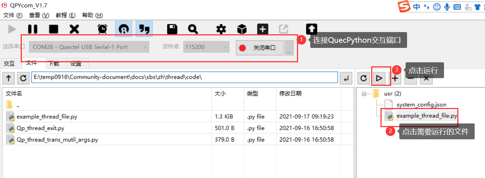
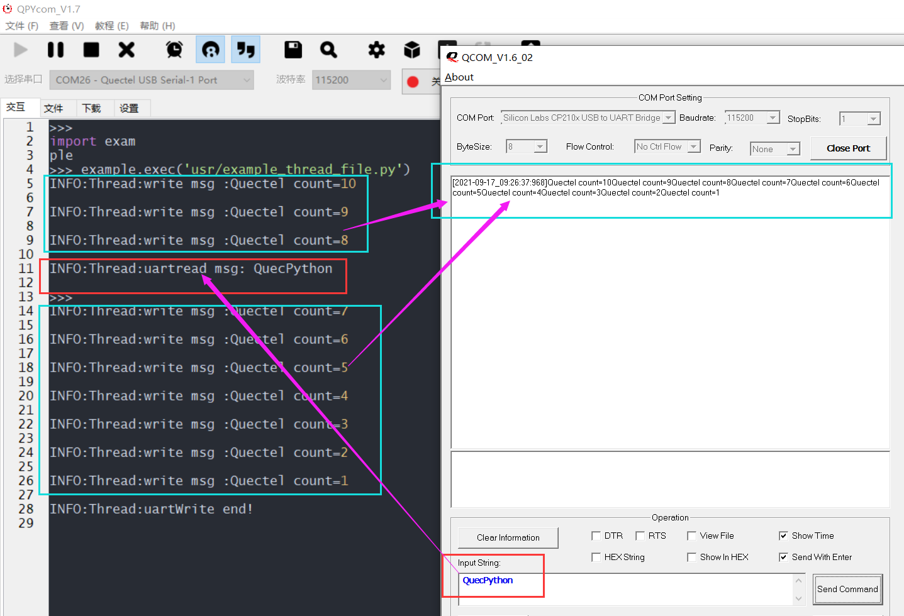

## 修订历史

| Version | Date       | Author     | Change expression |
| ------- | ---------- | ---------- | ----------------- |
| 1.0     | 2021-09-16 | David.Tang | Initial version   |

## 前言

本文以EC600U-CN为例介绍如何使用QuecPython的多线程功能。几乎所有操作系统均支持进程（Process）概念，操作系统中正在运行中的任务一般对应一个进程。当一个程序进入内存运行时，即变成一个进程。多线程扩展了多进程的概念，使得同一个进程可以同时并发处理多个任务。线程（Thread）也被称作轻量级进程（Lightweight Process），线程是进程的执行单元。类似进程在操作系统中的地位，线程在程序中是独立的、并发的执行流。

## 硬件描述

线程是软件层面的功能实现，硬件方面只需要足够的内存即可，此处不再赘述。

## 软件设计

thread 模块提供创建新线程的方法，并提供互斥锁，具体的功能介绍见：[_thread](https://python.quectel.com/wiki/#/zh-cn/api/pythonStdlib?id=_thread-%e5%a4%9a%e7%ba%bf%e7%a8%8b)

## 交互操作

使用QPYcom工具和EC600S-CN进行交互，具体如下截图。

```python
>>> import _thread
>>> _thread.get_ident()
2126467632
>>> _thread.get_heap_size()
748032
>>> lock = _thread.allocate_lock() 
>>> lock.acquire()
True
>>> lock.locked()
True
>>> lock.release()
>>> lock.locked()
False
```

注意：

1. import _thread即为让 _thread模块在当前空间可见。

2. 只有import _thread模块，才能使用 _thread内的函数和变量。

## 下载验证

### 软件代码

配套demo的参考代码为文档同目录下的example_thread_file.py文件。下载example_thread_file.py文件到EC600U-CN并运行，代码如下：

```python
import _thread
import utime
import log
from machine import UART  

# 设置日志输出级别
log.basicConfig(level=log.INFO)
uart_log = log.getLogger("Thread")

state = 1
msglen = 0
count = 10
uart = UART(UART.UART2, 115200, 8, 0, 1, 0)

def uartwrite():
    global count
    while count:
        write_msg = "Quectel count={}".format(count)  # 发送数据
        uart.write(write_msg)
        uart_log.info("write msg :{}".format(write_msg))
        utime.sleep(1)
        count -= 1
        if count == 0:
            break
    uart_log.info("uartWrite end!")

def uartread():
    global state
    global msglen
    while 1:
        utime.sleep_ms(10)
        msgLen = uart.any()   # 返回是否有可读取的数据长度
        if msgLen:
            msg = uart.read(msgLen)  # 当有数据时进行读取
            utf8_msg = msg.decode()  # 初始数据是字节类型（bytes）,将字节类型数据转STR
            uart_log.info("uartread msg: {}".format(utf8_msg))
            state = 0
            break
        else:
            continue

def run():
    _thread.start_new_thread(uartread, ())  # 创建一个线程来监听接收uart消息
    _thread.start_new_thread(uartwrite, ())


if __name__ == "__main__":
    run()
    while 1:
        if state:
            pass
        else:
            break

```

### 硬件连接

通过type-c接口给EC600U-CN供电，UART与TTL转USB模块的连接如下表（仅供参考）：

| EC600U模组_PIN脚 | EC600U_QuecPython_EVB_V1.3 | TTL转USB模块 |
| :--------------: | :------------------------: | :----------: |
|      PIN31       |          J5_PIN9           |      Tx      |
|      PIN32       |          J5_PIN8           |      Rx      |
|        /         |            GND             |     GND      |

硬件连接展示图如下所示：


### 运行效果

（1）打开QPYcom运行example_thread_file.py，如下图：



（2）由于两个线程同时进行，故UART写数据的同时，可向EC600U-CN串口发送数据（如下只表示读写的同时进行，但是具体的log输出顺序取决于手动发送的时间）。如下是在EC600U-CN写数据的第三和第四间隙，通过TTL转USB向EC600U-CN发送“QuecPython”。



## 配套代码

<!-- * [下载代码](code/example_thread_file.py) -->

<a href="code/example_thread_file.py" target="_blank">下载代码</a>

